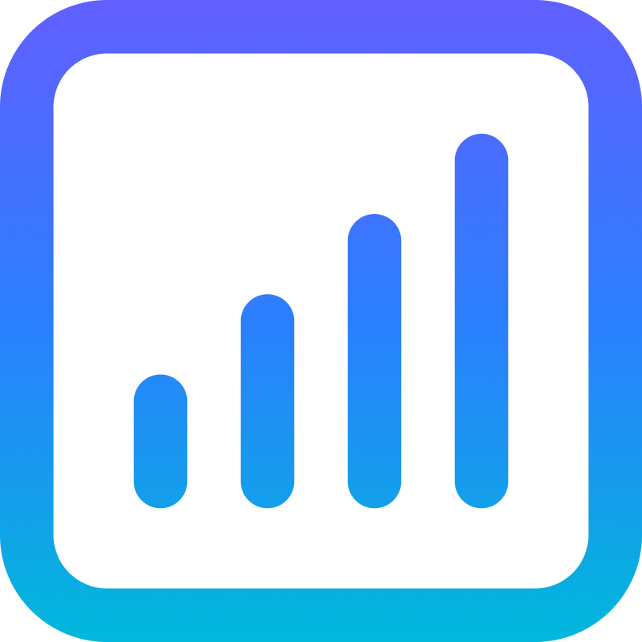

<div align="center">
  <a href="https://github.com/cyrildewit/eloquent-viewable">
    
  </a>
  <h3 align="center">Eloquent Viewable</h3>
  <p align="center">
    A minimalistic analytics package for Laravel with seamless view tracking for Eloquent models
  </p>
  <br/>
  <p align="center">
    <a href="https://packagist.org/packages/cyrildewit/eloquent-viewable"></a>        
      <a href="https://packagist.org/packages/cyrildewit/eloquent-viewable"></a>
      <a href="https://github.com/cyrildewit/eloquent-viewable/actions"></a>
      <a href="https://packagist.org/packages/cyrildewit/eloquent-viewable"></a>
      <a href="https://codecov.io/gh/cyrildewit/eloquent-viewable"></a>
  </p>
</div>
<hr/>
<details>
  <summary>Table of Contents</summary>
  <ol>
    <li><a href="#introduction">Introduction</a></li>
    <li><a href="#getting-started">Getting Started</a>
      <ul>
        <li><a href="#version-compatibility">Version Compatibility</a></li>
        <li><a href="#installation">Installation</a></li>
      </ul>
    </li>
    <li><a href="#usage">Usage</a>
      <ul>
        <li><a href="#preparing-your-model">Preparing your model</a></li>
        <li><a href="#recording-views">Recording views</a></li>
        <li><a href="#setting-a-cooldown">Setting a cooldown</a></li>
        <li><a href="#retrieving-view-counts">Retrieving view counts</a>
          <ul>
            <li><a href="#get-total-view-count">Get total view count</a></li>
            <li><a href="#get-view-count-for-a-specific-period">Get view count for a specific period</a>
            </li>
            <li><a href="#get-unique-view-count">Get unique view count</a></li>
          </ul>
        </li>
        <li><a href="#ordering-models-by-view-count">Ordering models by view count</a>
          <ul>
            <li><a href="#order-by-view-count">Order by view count</a></li>
            <li><a href="#order-by-unique-view-count">Order by unique view count</a></li>
            <li><a href="#order-by-view-count-within-the-specified-period">Order by view count within the
              specified period</a></li>
            <li><a href="#order-by-view-count-within-the-specified-collection">Order by view count within
              the specified collection</a></li>
          </ul>
        </li>
        <li><a href="#get-view-count-of-viewable-type">Get view count of viewable type</a></li>
        <li><a href="#view-collections">View collections</a></li>
        <li><a href="#remove-views-on-delete">Remove views on delete</a></li>
        <li><a href="#caching-view-counts">Caching view counts</a></li>
      </ul>
    </li>
    <li><a href="#optimizing">Optimizing</a>
      <ul>
        <li><a href="#database-indexes">Database indexes</a></li>
        <li><a href="#caching">Caching</a></li>
      </ul>
    </li>
    <li><a href="#extending">Extending</a>
      <ul>
        <li><a href="#custom-information-about-visitor">Custom information about visitor</a></li>
        <li><a href="#using-your-own-views-eloquent-model">Using your own Views Eloquent model</a></li>
        <li><a href="#using-your-own-view-eloquent-model">Using your own View Eloquent model</a></li>
        <li><a href="#using-a-custom-crawler-detector">Using a custom crawler detector</a></li>
        <li><a href="#adding-macros-to-the-views-class">Adding macros to the Views class</a></li>
      </ul>
    </li>
    <li><a href="#upgrading">Upgrading</a></li>
    <li><a href="#changelog">Changelog</a></li>
    <li><a href="#contributing">Contributing</a></li>
    <li><a href="#credits">Credits</a></li>
  </ol>
</details>

## Introduction

**Eloquent Viewable** is a flexible and minimalistic analytics package for Laravel that allows seamless tracking of
views for Eloquent models. Whether you're running a blog, an e-commerce store, or a custom Laravel application, this
package lets you log and analyze views without relying on external analytics services.

### Quick Example

Once installed, you can track and retrieve views effortlessly:

```php
// Return total view count
views($post)->count();

// Return total unique view count since 20 February 2017
views($post)->unique()->period(Period::since('2017-02-20'))->count();

// Record a view
views($post)->record();
```

### Key Features

- Track **total** and **unique** views for any Eloquent model
- Query views by custom date ranges or time periods
- Prevent duplicate views with a configurable **cooldown system**
- Order models by views and unique visitors
- Optimize performance with **built-in caching**
- Ignore views from **crawlers, blocked IPs, and DNT users**

### How It Works

Tracking views is more than just incrementing a counter — it requires a thoughtful approach to ensure accuracy, prevent
artificial inflation, and allow for meaningful analytics. Eloquent Viewable takes a flexible and database-driven
approach to view tracking, giving you control over how views are recorded, counted, and retrieved.

- **Persistent View Logging:** Every view is stored as a database record, allowing queries based on time range, visitor uniqueness, and other metadata.
- **Visitor Identification & Cooldown Protection:** Unique visitors are identified using long-lived cookies, and cooldown periods prevent duplicate views within a short timeframe to be stored.
- **Optimized Count Performance:** Built-in caching reduces database load while maintaining accuracy.
- **Crawler & Visitor Filtering:** Views from crawlers, ignored IPs, and DNT-enabled users are automatically excluded.
- **Scalability Considerations:**  Storing every view individually allows for detailed tracking but increases database load. For high-traffic applications, caching, pruning old records, and partitioning strategies may be necessary.

## Getting Started

### Version Compatibility

| Package Version                                                            | Laravel    | PHP  |
|----------------------------------------------------------------------------|------------|------|
| [8.x](https://packagist.org/packages/cyrildewit/eloquent-viewable#8.x-dev) | 12.x       | 8.4+ |
| [7.x](https://packagist.org/packages/cyrildewit/eloquent-viewable#7.x-dev) | 6.x – 12.x | 7.4+ |

Support for Lumen is not maintained.

### Installation

First, you need to install the package via Composer:

```bash
composer require cyrildewit/eloquent-viewable:^8
```

Publish the database migrations and review them:

```bash
php artisan vendor:publish --provider="CyrildeWit\EloquentViewable\EloquentViewableServiceProvider" --tag="migrations"
```

Run the database migrations to create the necessary tables:

```bash
php artisan migrate
```

You can optionally publish the config file:

```bash
php artisan vendor:publish --provider="CyrildeWit\EloquentViewable\EloquentViewableServiceProvider" --tag="config"
```

## Usage

### Preparing your model

To associate views with a model, the model **must** implement the following interface and trait:

- **Interface:** `CyrildeWit\EloquentViewable\Contracts\Viewable`
- **Trait:** `CyrildeWit\EloquentViewable\InteractsWithViews`

Example:

```php
use Illuminate\Database\Eloquent\Model;
use CyrildeWit\EloquentViewable\InteractsWithViews;
use CyrildeWit\EloquentViewable\Contracts\Viewable;

class Post extends Model implements Viewable
{
    use InteractsWithViews;

    // ...
}
```

### Recording views

To track a view, simply call the `record` method on the fluent `Views` instance:

```php
views($post)->record();
```

**Where Should You Record Views?**

The recommended place to record views is inside your controller’s method that handles displaying the model. For example:

```php
// PostController.php
public function show(Post $post)
{
    views($post)->record();

    return view('post.show', compact('post'));
}
```

This ensures that views are only recorded when the page is actually rendered for a user.

> [!WARNING]  
> By default, this package **automatically ignores views from crawlers** to prevent inaccurate counts. Keep this in mind
> when testing—tools like **Postman** are often detected as crawlers and will not trigger a recorded view.

### Setting a cooldown

You may use the `cooldown` method on the `Views` instance to add a cooldown between view records. When you set a
cooldown, you need to specify the number of minutes.

```php
views($post)
    ->cooldown($minutes)
    ->record();
```

Instead of passing the number of minutes as an integer, you can also pass a `DateTimeInterface` instance.

```php
$expiresAt = now()->addHours(3);

views($post)
    ->cooldown($expiresAt)
    ->record();
```

#### How it works

When recording a view with a session delay, this package also saves a snapshot of the view in the visitor’s session with
an expiration datetime. Whenever the visitor views the item again, the package checks their session and decides whether
the view should be saved in the database.

### Retrieving view counts

#### Get total view count

```php
views($post)->count();
```

#### Get view count for a specific period

```php
use CyrildeWit\EloquentViewable\Support\Period;

// Example: get view count from 2017 upto 2018
views($post)
    ->period(Period::create('2017', '2018'))
    ->count();
```

The `Period` class that comes with this package provides many handy features. The API of the `Period` class looks as
follows:

##### Specifying a date range

```php
$startDateTime = Carbon::createFromDate(2017, 4, 12);
$endDateTime = '2017-06-12';

Period::create($startDateTime, $endDateTime);
```

##### Since a specific date

```php
Period::since(Carbon::create(2017));
```

##### Up to a specific date

```php
Period::upto(Carbon::createFromDate(2018, 6, 1));
```

##### For past period

Uses `Carbon::today()` as start datetime minus the given unit.

```php
Period::pastDays(int $days);
Period::pastWeeks(int $weeks);
Period::pastMonths(int $months);
Period::pastYears(int $years);
```

##### For custom time subtraction

Uses `Carbon::now()` as start datetime minus the given unit.

```php
Period::subSeconds(int $seconds);
Period::subMinutes(int $minutes);
Period::subHours(int $hours);
Period::subDays(int $days);
Period::subWeeks(int $weeks);
Period::subMonths(int $months);
Period::subYears(int $years);
```

#### Get unique view count

If you only want to retrieve the unique view count, you can simply add the `unique` method to the chain.

```php
views($post)
    ->unique()
    ->count();
```

### Ordering models by view count

The `Viewable` trait adds two scopes to your model: `orderByViews` and `orderByUniqueViews`.

#### Order by view count

```php
Post::orderByViews()->get(); // descending
Post::orderByViews('asc')->get(); // ascending
```

#### Order by unique view count

```php
Post::orderByUniqueViews()->get(); // descending
Post::orderByUniqueViews('asc')->get(); // ascending
```

#### Order by view count within the specified period

```php
Post::orderByViews('asc', Period::pastDays(3))->get();  // descending
Post::orderByViews('desc', Period::pastDays(3))->get(); // ascending
```

And of course, it's also possible with the unique views variant:

```php
Post::orderByUniqueViews('asc', Period::pastDays(3))->get();  // descending
Post::orderByUniqueViews('desc', Period::pastDays(3))->get(); // ascending
```

#### Order by view count within the specified collection

```php
Post::orderByViews('asc', null, 'custom-collection')->get();  // descending
Post::orderByViews('desc', null, 'custom-collection')->get(); // ascending

Post::orderByUniqueViews('asc', null, 'custom-collection')->get();  // descending
Post::orderByUniqueViews('desc', null, 'custom-collection')->get(); // ascending
```

### Get view count of viewable type

If you want to know how many views a specific viewable type has, you need to pass an empty Eloquent model to the
`views()` helper like so:

```php
views(new Post())->count();
```

You can also pass a fully qualified class name. The package will then resolve an instance from the application
container.

```php
views(Post::class)->count();
views('App\Post')->count();
```

### View collections

If you have different types of views for the same viewable type, you may want to store them in their own collection.

```php
views($post)
    ->collection('customCollection')
    ->record();
```

To retrieve the view count in a specific collection, you can reuse the same `collection()` method.

```php
views($post)
    ->collection('customCollection')
    ->count();
```

### Remove views on delete

To automatically delete all views associated with a viewable Eloquent model when it is deleted, set the
`removeViewsOnDelete` property to `true` in your model definition.

```php
protected $removeViewsOnDelete = true;
```

### Caching view counts

Caching the view count can be challenging in some scenarios. The period can be for example dynamic which makes caching
not possible. That's why you can make use of the in-built caching functionality.

To cache the view count, simply add the `remember()` method to the chain. The default lifetime is forever.

Examples:

```php
views($post)->remember()->count();
views($post)->period(Period::create('2018-01-24', '2018-05-22'))->remember()->count();
views($post)->period(Period::upto('2018-11-10'))->unique()->remember()->count();
views($post)->period(Period::pastMonths(2))->remember()->count();
views($post)->period(Period::subHours(6))->remember()->count();
```

```php
// Cache for 3600 seconds
views($post)->remember(3600)->count();

// Cache until the defined DateTime
views($post)->remember(now()->addWeeks(2))->count();

// Cache forever
views($post)->remember()->count();
```

## Optimizing

### Database indexes

The default `views` table migration file has already two indexes for `viewable_id` and `viewable_type`.

If you have enough storage available, you can add another index for the `visitor` column. Depending on the amount of
views, this may speed up your queries in some cases.

### Caching

Caching view counts can have a big impact on the performance of your application. You can read the documentation about
caching the view count [here](#caching-view-counts)

Using the `remember()` method will only cache view counts made by the `count()` method. The `orderByViews` and
`orderByUnique` query scopes aren't using these values because they only add something to the query builder. To optimize
these queries, you can add an extra column or multiple columns to your viewable database table with these counts.

Example: we want to order our blog posts by **unique views** count. The first thing that may come to your mind is to use
the `orderByUniqueViews` query scope.

```php
$posts = Post::latest()->orderByUniqueViews()->paginate(20);
```

This query is quite slow when you have a lot of views stored. To speed things up, you can add for example a
`unique_views_count` column to your `posts` table. We will have to update this column periodically with the unique views
count. This can easily be achieved using a scheduled Laravel command.

There may be a faster way to do this, but such command can be like:

```php
$posts = Post::all();

foreach($posts as $post) {
    $post->unique_views_count = views($post)->unique()->count();
}
```

## Extending

If you want to extend or replace one of the core classes with your own implementations, you can override them:

- `CyrildeWit\EloquentViewable\Views`
- `CyrildeWit\EloquentViewable\View`
- `CyrildeWit\EloquentViewable\Visitor`
- `CyrildeWit\EloquentViewable\CrawlerDetectAdapter`

> [!NOTE]
> Don't forget that all custom classes must implement their original interfaces._

### Custom information about visitor

The `Visitor` class is responsible for providing the `Views` builder information about the current visitor. The
following information is provided:

- a unique identifier (stored in a cookie)
- ip address
- check for Do No Track header
- check for crawler

The default `Visitor` class gets its information from the request. Therefore, you may experience some issues when using
the `Views` builder via a RESTful API. To solve this, you will need to provide your own data about the visitor.

You can override the `Visitor` class globally or locally.

#### Create your own `Visitor` class

Create you own `Visitor` class in your Laravel application and implement the
`CyrildeWit\EloquentViewable\Contracts\Visitor` interface. Create the required methods by the interface.

Alternatively, you can extend the default `Visitor` class that comes with this package.

#### Globally

Simply bind your custom `Visitor` implementation to the `CyrildeWit\EloquentViewable\Contracts\Visitor` contract.

```php
$this->app->bind(
    \CyrildeWit\EloquentViewable\Contracts\Visitor::class,
    \App\Services\Views\Visitor::class
);
```

#### Locally

You can also set the visitor instance using the `useVisitor` setter method on the `Views` builder.

```php
use App\Services\Views\Visitor;

views($post)
    ->useVisitor(new Visitor()) // or app(Visitor::class)
    ->record();
```

### Using your own `Views` Eloquent model

Bind your custom `Views` implementation to the `\CyrildeWit\EloquentViewable\Contracts\Views`.

Change the following code snippet and place it in the `register` method in a service provider (for example
`AppServiceProvider`).

```php
$this->app->bind(
    \CyrildeWit\EloquentViewable\Contracts\Views::class,
    \App\Services\Views\Views::class
);
```

### Using your own `View` Eloquent model

Bind your custom `View` implementation to the `\CyrildeWit\EloquentViewable\Contracts\View`.

Change the following code snippet and place it in the `register` method in a service provider (for example
`AppServiceProvider`).

```php
$this->app->bind(
    \CyrildeWit\EloquentViewable\Contracts\View::class,
    \App\Models\View::class
);
```

### Using a custom crawler detector

Bind your custom `CrawlerDetector` implementation to the `\CyrildeWit\EloquentViewable\Contracts\CrawlerDetector`.

Change the following code snippet and place it in the `register` method in a service provider (for example
`AppServiceProvider`).

```php
$this->app->singleton(
    \CyrildeWit\EloquentViewable\Contracts\CrawlerDetector::class,
    \App\Services\Views\CustomCrawlerDetectorAdapter::class
);
```

### Adding macros to the `Views` class

```php
use CyrildeWit\EloquentViewable\Views;

Views::macro('countAndRemember', function () {
    return $this->remember()->count();
});
```

Now you're able to use this shorthand like this:

```php
views($post)->countAndRemember();

Views::forViewable($post)->countAndRemember();
```

## Upgrading

Please see [UPGRADING](UPGRADING.md) for detailed upgrade guide.

## Changelog

Please see [CHANGELOG](CHANGELOG.md) for more information on what has changed recently.

## Contributing

Please see [CONTRIBUTING](CONTRIBUTING.md) for details.

## Credits

- **Cyril de Wit** - _Initial work_ - [cyrildewit](https://github.com/cyrildewit)

See also the list of [contributors](https://github.com/cyrildewit/eloquent-viewable/graphs/contributors) who
participated in this project.

**Helpful Resources:**

- [Implementing A Page View Counter In Laravel](https://stidges.com/implementing-a-page-view-counter-in-laravel) - *
  *[Stidges](https://github.com/stidges)**

## Alternatives

- [antonioribeiro/tracker](https://github.com/antonioribeiro/tracker)
- [foothing/laravel-simple-pageviews](https://github.com/foothing/laravel-simple-pageviews)
- [awssat/laravel-visaits](https://github.com/awssat/laravel-visits)
- [Kryptonit3/Counter](https://github.com/Kryptonit3/Counter)
- [fraank/ViewCounter](https://github.com/fraank/ViewCounter)

Feel free to add more alternatives!

## License

This project is licensed under the MIT License - see the [LICENSE](LICENSE) file for details.
