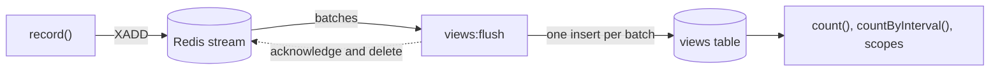

<div align="center">
  <a href="https://github.com/cyrildewit/eloquent-viewable">
    
  </a>
  <h3 align="center">Eloquent Viewable</h3>
  <p align="center">
    A minimalistic analytics package for Laravel with seamless view tracking for Eloquent models
  </p>
  <br/>
  <p align="center">
    <a href="https://packagist.org/packages/cyrildewit/eloquent-viewable"></a>        
      <a href="https://packagist.org/packages/cyrildewit/eloquent-viewable"></a>
      <a href="https://github.com/cyrildewit/eloquent-viewable/actions"></a>
      <a href="https://packagist.org/packages/cyrildewit/eloquent-viewable"></a>
      <a href="https://codecov.io/gh/cyrildewit/eloquent-viewable"></a>
  </p>
</div>
<hr/>
<details>
  <summary>Table of Contents</summary>
  <ol>
    <li><a href="#introduction">Introduction</a></li>
    <li><a href="#getting-started">Getting Started</a>
      <ul>
        <li><a href="#version-compatibility">Version Compatibility</a></li>
        <li><a href="#installation">Installation</a></li>
      </ul>
    </li>
    <li><a href="#usage">Usage</a>
      <ul>
        <li><a href="#preparing-your-model">Preparing your model</a></li>
        <li><a href="#recording-views">Recording views</a>
          <ul>
            <li><a href="#recording-from-a-route">Recording from a route</a></li>
            <li><a href="#finding-out-why-a-view-was-not-recorded">Finding out why a view was not recorded</a></li>
          </ul>
        </li>
        <li><a href="#queueing-view-recording">Queueing view recording</a></li>
        <li><a href="#setting-a-cooldown">Setting a cooldown</a></li>
        <li><a href="#retrieving-view-counts">Retrieving view counts</a>
          <ul>
            <li><a href="#get-total-view-count">Get total view count</a></li>
            <li><a href="#get-view-count-for-a-specific-period">Get view count for a specific period</a>
            </li>
            <li><a href="#compare-with-the-previous-period">Compare with the previous period</a></li>
            <li><a href="#get-view-counts-grouped-by-interval">Get view counts grouped by interval</a></li>
            <li><a href="#get-view-counts-per-collection">Get view counts per collection</a></li>
            <li><a href="#get-unique-view-count">Get unique view count</a></li>
          </ul>
        </li>
        <li><a href="#ordering-models-by-view-count">Ordering models by view count</a>
          <ul>
            <li><a href="#order-by-view-count">Order by view count</a></li>
            <li><a href="#order-by-unique-view-count">Order by unique view count</a></li>
            <li><a href="#order-by-view-count-within-the-specified-period">Order by view count within the
              specified period</a></li>
            <li><a href="#order-by-view-count-within-the-specified-collection">Order by view count within
              the specified collection</a></li>
          </ul>
        </li>
        <li><a href="#most-viewed-across-the-app">Most viewed across the app</a></li>
        <li><a href="#get-view-count-of-viewable-type">Get view count of viewable type</a></li>
        <li><a href="#get-view-counts-of-models-you-already-have">Get view counts of models you already have</a></li>
        <li><a href="#view-collections">View collections</a></li>
        <li><a href="#who-viewed-what">Who viewed what</a></li>
        <li><a href="#storing-context-with-a-view">Storing context with a view</a></li>
        <li><a href="#remove-views-on-delete">Remove views on delete</a></li>
        <li><a href="#caching-view-counts">Caching view counts</a></li>
      </ul>
    </li>
    <li><a href="#samples">Samples</a></li>
    <li><a href="#testing">Testing</a></li>
    <li><a href="#optimizing">Optimizing</a>
      <ul>
        <li><a href="#database-indexes">Database indexes</a></li>
        <li><a href="#caching">Caching</a></li>
      </ul>
    </li>
    <li><a href="#extending">Extending</a>
      <ul>
        <li><a href="#custom-information-about-visitor">Custom information about visitor</a></li>
        <li><a href="#using-your-own-views-eloquent-model">Using your own Views Eloquent model</a></li>
        <li><a href="#using-your-own-view-eloquent-model">Using your own View Eloquent model</a></li>
        <li><a href="#customizing-how-views-are-created">Customizing how views are created</a></li>
        <li><a href="#choosing-where-views-are-stored">Choosing where views are stored</a></li>
        <li><a href="#adding-a-recording-guard">Adding a recording guard</a></li>
        <li><a href="#customizing-how-views-are-counted">Customizing how views are counted</a></li>
        <li><a href="#adding-a-bucket-grammar-for-another-database-driver">Adding a bucket grammar for another database driver</a></li>
        <li><a href="#using-a-custom-crawler-detector">Using a custom crawler detector</a></li>
        <li><a href="#adding-macros-to-the-views-class">Adding macros to the Views class</a></li>
      </ul>
    </li>
    <li><a href="#upgrading">Upgrading</a></li>
    <li><a href="#changelog">Changelog</a></li>
    <li><a href="#contributing">Contributing</a></li>
    <li><a href="#credits">Credits</a></li>
  </ol>
</details>

## Introduction

**Eloquent Viewable** is a flexible and minimalistic analytics package for Laravel that allows seamless tracking of
views for Eloquent models. Rather than incrementing a single counter, it stores each view as its own database record,
so you can analyze totals, unique visitors, and custom time periods entirely within your own application. Whether
you're running a blog, an e-commerce store, or a custom Laravel application, this package lets you log and analyze
views without relying on external analytics services.

### Quick Example

Once installed, you can track and retrieve views effortlessly:

```php
// Return total view count
views($post)->count();

// Return total unique view count since 20 February 2017
views($post)->unique()->period(Period::since('2017-02-20'))->count();

// Record a view
views($post)->record();
```

### Key Features

- Track **total** and **unique** views for any Eloquent model
- Query views by custom date ranges or time periods
- Prevent duplicate views with a configurable **cooldown system**
- Order models by views and unique visitors, and rank the most viewed content across every model
- Optimize performance with **built-in caching**
- Ignore views from **crawlers, blocked IPs, and visitors who opt out** with Do Not Track or Global Privacy Control

## Getting Started

### Version Compatibility

| Package Version                                                            | Laravel    | PHP  |
|----------------------------------------------------------------------------|------------|------|
| [8.x](https://packagist.org/packages/cyrildewit/eloquent-viewable#8.x-dev) | 13.x       | 8.5+ |
| [7.x](https://packagist.org/packages/cyrildewit/eloquent-viewable#7.x-dev) | 6.x – 13.x | 7.4+ |

Support for Lumen is not maintained.

### Installation

First, you need to install the package via Composer:

```bash
composer require cyrildewit/eloquent-viewable:^8
```

Publish the database migrations and review them:

```bash
php artisan vendor:publish --provider="CyrildeWit\EloquentViewable\EloquentViewableServiceProvider" --tag="migrations"
```

Run the database migrations to create the necessary tables:

```bash
php artisan migrate
```

You can optionally publish the config file:

```bash
php artisan vendor:publish --provider="CyrildeWit\EloquentViewable\EloquentViewableServiceProvider" --tag="config"
```

## Usage

### Preparing your model

To associate views with a model, the model **must** implement the following interface and trait:

- **Interface:** `CyrildeWit\EloquentViewable\Contracts\Viewable`
- **Trait:** `CyrildeWit\EloquentViewable\Concerns\InteractsWithViews`

Example:

```php
use Illuminate\Database\Eloquent\Model;
use CyrildeWit\EloquentViewable\Concerns\InteractsWithViews;
use CyrildeWit\EloquentViewable\Contracts\Viewable;

class Post extends Model implements Viewable
{
    use InteractsWithViews;

    // ...
}
```

### Recording views

To track a view, simply call the `record` method on the fluent `Views` instance:

```php
views($post)->record();
```

**Where Should You Record Views?**

The recommended place to record views is inside your controller’s method that handles displaying the model. For example:

```php
// PostController.php
public function show(Post $post)
{
    views($post)->record();

    return view('post.show', compact('post'));
}
```

This ensures that views are only recorded when the page is actually rendered for a user.

Every call to `record()` passes a list of guards before anything is written. The list lives under `recording.guards`
in the config file and is the only switch: a guard runs when it is listed and not otherwise. Out of the box bot traffic,
the addresses in `recording.ignored_ip_addresses` and pages the browser only prefetches are dropped and cooldowns are
enforced. Publish the config and
uncomment `IgnoreDoNotTrack` or `IgnoreGlobalPrivacyControl` to honour those headers, or remove a guard to turn its
check off. Or add a guard of your own, see [Adding a recording guard](#adding-a-recording-guard).

> [!NOTE]
> `IgnoreCrawlers` is listed by default, so keep it in mind when testing. Tools like **Postman** are often detected as
> crawlers and will not trigger a recorded view.

`record()` returns `true` when the view was stored or queued and `false` when a guard refused it.

#### Recording from a route

To record a view without touching the controller, add the `views` middleware to the route. It records the model bound
to the route once the response is ready:

```php
Route::get('/posts/{post}', ShowPost::class)->middleware('views');
```

Only a successful response to a `GET` request records a view, so a 404, a redirect, an error or a form post records
nothing. The view passes the same guards as `record()` in a controller. The middleware reads the bound models after the
controller has run, so it works on either side of `SubstituteBindings`.

Without arguments it records the last route parameter bound to a `Viewable` model. In `/users/{user}/posts/{post}`
that is the post, the page's subject. Name a route parameter or a model class to pick another, or several to record
each of them:

```php
use CyrildeWit\EloquentViewable\Http\Middleware\RecordViews;

->middleware('views:user')                                    // the {user} parameter
->middleware(RecordViews::using(Post::class))                 // every parameter bound to a Post
->middleware(RecordViews::using(['user', 'post']))            // both
->middleware(RecordViews::using('post', collection: 'amp', cooldown: 30, queue: true))
```

As with Laravel's `can` middleware, a value with a backslash is a class name and anything else a route parameter.
`RecordViews::using()` builds the middleware string, `views:post,collection=amp,cooldown=30,queue=true`, which you can
also write by hand. A route that binds nothing to record, or a parameter that is not a `Viewable`, throws
`InvalidViewable` on the first request, so a typo shows up straight away.

If storing the view fails, the middleware reports the `RecordingFailed` exception and still sends the page. For a
condition, a `viewedBy()` or a `context()`, call `views()` in the controller instead.

> [!TIP]
> Inertia and Livewire reload a page with another `GET` to the same route, which the middleware counts again. A
> `cooldown` keeps those reloads from adding views.

#### Finding out why a view was not recorded

`record()` only says whether the view got through. When you need to know what became of it, call `attempt()` instead.
It runs the same guards and writes the same view, but returns a `Recording\Data\RecordResult` that says whether the
view was stored, queued, or skipped and by which guard:

```php
use CyrildeWit\EloquentViewable\Recording\Guards\EnforceCooldown;

$result = views($post)->attempt();

$result->recorded;   // true when the view was stored or queued
$result->queued;     // true when the write was handed to the queue
$result->skippedBy;  // the guard that refused the view, or null

if ($result->wasSkippedBy(EnforceCooldown::class)) {
    // the visitor saw this post a moment ago
}
```

The same information reaches listeners through an event. When a guard refuses, the package dispatches
`Recording\Events\ViewSkipped` with the attempt and the guard. Listen for it to log why a count stays where it is
without touching the code that records:

```php
use CyrildeWit\EloquentViewable\Recording\Events\ViewSkipped;

Event::listen(ViewSkipped::class, function (ViewSkipped $event): void {
    Log::debug('View skipped by '.$event->guard::class, [
        'viewable' => $event->attempt->viewable->getKey(),
        'collection' => $event->attempt->collection,
    ]);
});
```

### Queueing view recording

By default, views are stored during the request. On high-traffic pages you can defer the
database write to a queued job instead. This keeps the request fast and moves the insert to
a queue worker.

Queue an individual view on the fly using the `queue()` method:

```php
views($post)->queue()->record();
```

Or enable queueing globally in the `eloquent-viewable.php` config file:

```php
'recording' => [
    'queue' => [
        'enabled' => true,      // queue every recorded view
        'connection' => null,   // null uses the default queue connection
        'queue' => null,        // null uses the connection's default queue
    ],
],
```

When queueing is enabled globally, you can still force an individual view to be recorded
synchronously:

```php
views($post)->queue(false)->record();
```

All filtering still runs during the request, including crawler detection, the Do Not Track
header, ignored IP addresses and cooldowns. Bots and views on cooldown are therefore never
queued; only the database write is deferred.

Queueing defers the write, and so does a store that buffers views before landing them in the
table. Combining the two is harmless but gains nothing: every view becomes a job whose only
work is handing the record to the buffer. With a buffering store, leave `recording.queue.enabled` off.

> [!WARNING]  
> When a view is queued, the `ViewRecorded` event is dispatched from the queue worker
> instead of the request. Its listeners therefore run **without request context**. The
> session, cookies, `request()` and `auth()->user()` are unavailable and will return empty
> or `null` values. If a listener needs request-derived data (such as the IP address),
> capture it during the request instead of reading it inside the listener. The event
> carries the `ViewRecord` that was recorded, under `$event->record`. The signed-in model
> is already on it as `viewerType` and `viewerId` when [recording the viewer](#who-viewed-what)
> is enabled, and anything passed to [`context()`](#storing-context-with-a-view) as `context`.

### Setting a cooldown

You may use the `cooldown` method on the `Views` instance to add a cooldown between view records. When you set a
cooldown, you need to specify the number of minutes.

```php
views($post)
    ->cooldown($minutes)
    ->record();
```

Instead of passing the number of minutes as an integer, you can also pass a `DateTimeInterface` instance.

```php
$expiresAt = now()->addHours(3);

views($post)
    ->cooldown($expiresAt)
    ->record();
```

#### How it works

When a view is recorded with a cooldown, the `EnforceCooldown` guard starts a cooldown for that visitor, viewable and
collection. While it runs, `record()` returns `false` for the same combination and `attempt()` reports the
`EnforceCooldown` guard under `skippedBy`. Checking and starting a cooldown are
two separate steps, so two requests from the same visitor that arrive at the same moment may both be recorded.

#### Where cooldowns are kept

The `cooldown.store` config key names the store. Two drivers ship:

- `session` keeps cooldowns in the visitor's session, as in v8. This is the default. On routes without a session, such
  as stateless API routes, cooldowns do nothing.
- `cache` keeps cooldowns in a cache store, keyed by the visitor's id, so they also work without a session. The id comes
  from the visitor cookie, so a client that does not send the cookie back gets a new id, and a new cooldown, on every
  request.

```php
'cooldown' => [
    'store' => 'cache',
    'key' => 'cyrildewit.eloquent-viewable.cooldowns',
    'cache' => [
        'store' => 'redis', // null uses the default cache store
    ],
],
```

To add a driver, implement `Cooldowns\Contracts\CooldownStore` and register it with the `CooldownManager` in the
`register` method of a service provider. Then name it in the config.

```php
use CyrildeWit\EloquentViewable\Cooldowns\Contracts\CooldownStore;
use CyrildeWit\EloquentViewable\Cooldowns\CooldownManager;
use Illuminate\Contracts\Foundation\Application;

$this->app->make(CooldownManager::class)->extend('dynamodb', fn (Application $app): CooldownStore => new DynamoDbCooldownStore(
    $app->make(DynamoDbClient::class),
));
```

A store receives a string key and, for `put()`, the time the cooldown ends. `has()` returns whether a cooldown is still
running under that key.

### Retrieving view counts

#### Get total view count

```php
views($post)->count();
```

#### Get view count for a specific period

```php
use CyrildeWit\EloquentViewable\Support\Period;

// Example: get view count from 2017 up to 2018
views($post)
    ->period(Period::create('2017', '2018'))
    ->count();
```

The `Period` class that comes with this package provides many handy features. The API of the `Period` class looks as
follows:

A period is half-open: the start is included and the end is excluded. `Period::create('2018-01-01', '2018-02-01')`
covers all of January and nothing of February.

##### Specifying a date range

```php
$startDateTime = Carbon::createFromDate(2017, 4, 12);
$endDateTime = '2017-06-12';

Period::create($startDateTime, $endDateTime);
```

##### Since a specific date

```php
Period::since(Carbon::create(2017));
```

##### Up to, but not including, a specific date

```php
Period::upto(Carbon::createFromDate(2018, 6, 1));
```

##### For past period

Uses `Carbon::today()` as start datetime minus the given unit.

```php
Period::pastDays(int $days);
Period::pastWeeks(int $weeks);
Period::pastMonths(int $months);
Period::pastYears(int $years);
```

##### For custom time subtraction

Uses `Carbon::now()` as start datetime minus the given unit.

```php
Period::subSeconds(int $seconds);
Period::subMinutes(int $minutes);
Period::subHours(int $hours);
Period::subDays(int $days);
Period::subWeeks(int $weeks);
Period::subMonths(int $months);
Period::subYears(int $years);
```

Every relative constructor takes an optional timezone, an identifier such as `Australia/Sydney` or a `DateTimeZone`
built from one. A `past` period then starts at midnight of that zone instead of your application's, which is what
a customer in Sydney means by "the last seven days":

```php
Period::pastDays(7, 'Australia/Sydney');
```

##### From a string

Dashboards carry the period in the URL. `Period::parse()` reads the string forms, so the controller does not have
to:

```php
Period::parse('7d');                        // Period::pastDays(7)
Period::parse('3w');                        // Period::pastWeeks(3)
Period::parse('6m');                        // Period::pastMonths(6)
Period::parse('1y');                        // Period::pastYears(1)
Period::parse('12h');                       // Period::subHours(12), likewise 30min and 90s
Period::parse('2026-01-01..2026-02-01');    // Period::create('2026-01-01', '2026-02-01')
Period::parse('2026-01-01..');              // Period::since('2026-01-01')
Period::parse('..2026-02-01');              // Period::upto('2026-02-01')

Period::parse('7d', 'Australia/Sydney');    // Period::pastDays(7, 'Australia/Sydney')
```

A calendar unit (`d`, `w`, `m`, `y`) counts back from midnight and a clock unit (`s`, `min`, `h`) from now, matching
the constructors. A range bound is a date, `2026-01-01`, or a date and time, `2026-01-01T10:30:00`, read on the
clock of the timezone when one is given. The range is half-open like every period, so `2026-01-01..2026-02-01` is
January. Anything else throws `InvalidPeriod`.

`getRouteKey()` writes the string form back: the shorthand for a relative period, otherwise the bounds around `..`.
`Period::subDays(7)` counts from now rather than midnight, which no shorthand says, so it renders as its bounds and
the URL carries the moment it was built. The timezone a relative period was built in is not part of the key either;
pass it to `parse()` again on the way back.

##### In a route

`Period` is `UrlRoutable`, so a `{period}` route parameter binds without a `Route::bind()` call and an unreadable
value responds with a 404:

```php
Route::get('/posts/{post}/stats/{period}', function (Post $post, Period $period) {
    return views($post)->period($period)->countByInterval(Granularity::Day);
});

route('posts.stats', [$post, Period::pastDays(7)]); // /posts/1/stats/7d
```

Implicit binding reads the value in your application timezone. For a per-tenant zone, take the parameter as a
string and call `Period::parse($value, $tenant->timezone)` yourself.

##### Timezones

`viewed_at` is stored as the wall clock of your application timezone. Period bounds use that same zone, and bounds
you pass in another timezone are converted before they are compared. Keep `app.timezone` at `UTC`, Laravel's default,
unless you have a reason not to. To draw buckets on another clock, see
[buckets in another timezone](#buckets-in-another-timezone).

#### Compare with the previous period

The first thing a dashboard shows next to a count is how it moved. `compare()` counts the period and the period right
before it:

```php
$trend = views($post)->period(Period::pastDays(7))->compare();

$trend->current;        // 340
$trend->previous;       // 290
$trend->delta;          // 50
$trend->percent;        // 17.2, rounded to one decimal
$trend->currentPeriod;  // Period
$trend->previousPeriod; // Period, for a "compared with 20–27 Aug" label
```

`percent` is `null` when there were no views before, because growth from nothing has no percentage. `toArray()` gives
`current`, `previous`, `delta` and `percent`, and the comparison is `JsonSerializable`, so a controller can return it.

The previous period is `Period::previous()`, which is as wide as the period and ends exactly where it starts:

```php
Period::pastDays(7)->previous();                           // the 7 whole days before the last 7
Period::pastMonths(1)->previous();                         // the month before the last month
Period::subHours(12)->previous();                          // from 24 to 12 hours ago
Period::create('2026-01-01', '2026-02-01')->previous();    // 2025-12-01..2026-01-01
Period::pastDays(7)->previous()->previous();               // keeps going back
```

A relative period steps back by its own unit, so it stays aligned to the calendar. It has no end, though, so
`Period::pastDays(7)` also includes today so far while the 7 days before it are whole. An absolute period steps back
by its exact duration, so `2026-02-01..2026-03-01` gives the 28 days before it, not January. A period without both
bounds, such as `Period::since()`, keeps growing and has no width, so `previous()` and `compare()` throw
`InvalidPeriod`, as `compare()` does without a period.

`unique()`, `collection()`, `viewedBy()` and `timezone()` apply to both counts. With `remember()`, each count is cached
under its own key, so the previous window is cached as well.

#### Get view counts grouped by interval

`countByInterval()` returns the view count per hour, day, week, month or year over the period, with buckets that have
no views filled in with zero. It needs a period with a start date.

```php
use CyrildeWit\EloquentViewable\Support\Granularity;
use CyrildeWit\EloquentViewable\Support\Period;

$series = views($post)
    ->period(Period::pastDays(30))
    ->countByInterval(Granularity::Day);

foreach ($series as $bucket) {
    $bucket->start; // Carbon, the start of the bucket
    $bucket->end;   // Carbon, the start of the next bucket
    $bucket->count; // int
}

$series->total();  // the same number as views($post)->period(Period::pastDays(30))->count()
$series->intervals; // Collection<int, Bucket>
```

A series feeds a chart without reshaping. Labels are formatted down to the bucket width (`2026-09-01 14:00` for hours,
`2026-09-01` for days and weeks, where a week is labelled by its Monday, `2026-09` for months and `2026` for years):

```php
$series->labels();  // ['2026-09-01', '2026-09-02', ...]
$series->values();  // [14, 22, ...]
$series->peak();    // the Bucket with the most views, the earliest on a tie, or null without buckets
$series->average(); // float, the mean count per bucket

$series->toArray(); // ['granularity' => 'day', 'total' => 36, 'labels' => [...], 'values' => [...]]
```

`ViewSeries` is `Arrayable` and `JsonSerializable`, so returning it from a controller sends that array as JSON. Each
bucket carries its label as `$bucket->label` too.

Buckets are calendar-aligned, so the first one may start before the period, and weeks start on Monday. A bucket is
half-open like a period, so drilling into one gives the same count:

```php
views($post)->period($bucket->period())->count(); // === $bucket->count
```

`unique()`, `collection()` and `remember()` work as they do for `count()`:

```php
views($post)->period(Period::pastMonths(6))->unique()->countByInterval(Granularity::Month);
views(Post::class)->period(Period::pastWeeks(12))->collection('homepage')->countByInterval(Granularity::Week);
```

##### Buckets in another timezone

Buckets follow the clock of your application timezone. A dashboard for a customer in Sydney wants its days to start
at Sydney midnight, so name the zone the bucket boundaries should follow:

```php
$series = views($post)
    ->period(Period::pastDays(30))
    ->timezone('Australia/Sydney')
    ->countByInterval(Granularity::Day);

$series->timezone;                  // DateTimeZone, Australia/Sydney
$series->intervals->first()->start; // 00:00 in Australia/Sydney
```

`timezone()` takes an identifier such as `Europe/Amsterdam` or a `DateTimeZone` built from one. An offset or an
abbreviation throws `InvalidTimezone`, because it carries no daylight saving rules.

A relative period follows the same clock: `Period::pastDays(30)` in the example above starts at Sydney midnight
thirty days ago, not at midnight of your application timezone, so the first bucket is a whole day. A relative period
built with a zone of its own, `Period::pastDays(30, 'Europe/Amsterdam')`, keeps it. Absolute bounds are instants and
are not moved.

A plain `count()` reads the same re-anchored period but has no buckets to align, so the zone changes nothing else.
`remember()` keeps a separate cache entry per timezone.

The database shifts `viewed_at` before it truncates, by a fixed number of seconds the package works out in PHP, one
per stretch between daylight saving transitions of either zone inside the period. No driver needs zone tables, and
the labels the database emits agree with the series by construction, whichever tzdata the server carries.

A wall-clock hour that a transition repeats, in either zone, lands in one bucket, and an hour a transition skips
stays empty. Both match what happens without a timezone.

The database does the grouping, so the package ships a grammar per driver: SQLite, MySQL, MariaDB and Postgres. Any
other driver throws `UnsupportedDriver` until you
[register a grammar](#adding-a-bucket-grammar-for-another-database-driver) for it.

A call that would produce more than `querying.max_intervals` buckets (10,000 by default, configurable) throws
`InvalidInterval` before the database is queried.

#### Get view counts per collection

`collection()` narrows a count to one collection. `countByCollection()` returns the count of every collection at once,
keyed by name, with the most viewed first and ties in name order. Views recorded without a collection are keyed by
the empty string. Only collections with views are present, so a viewable without views gives an empty array.

```php
views($post)->countByCollection();
// ['' => 1200, 'sidebar' => 340, 'feed' => 88]
```

`unique()`, `period()`, `viewedBy()` and `remember()` work as they do for `count()`, and `collection()` narrows the
result to that one entry:

```php
views($post)->period(Period::pastDays(30))->unique()->countByCollection();
views(Post::class)->countByCollection();
```

#### Get unique view count

If you only want to retrieve the unique view count, you can simply add the `unique` method to the chain.

```php
views($post)
    ->unique()
    ->count();
```

### Ordering models by view count

The `Viewable` trait adds two scopes to your model: `orderByViews` and `orderByUniqueViews`.

#### Order by view count

```php
Post::orderByViews()->get(); // descending
Post::orderByViews('asc')->get(); // ascending
```

#### Order by unique view count

```php
Post::orderByUniqueViews()->get(); // descending
Post::orderByUniqueViews('asc')->get(); // ascending
```

#### Order by view count within the specified period

```php
Post::orderByViews('asc', Period::pastDays(3))->get();  // ascending
Post::orderByViews('desc', Period::pastDays(3))->get(); // descending
```

And of course, it's also possible with the unique views variant:

```php
Post::orderByUniqueViews('asc', Period::pastDays(3))->get();  // ascending
Post::orderByUniqueViews('desc', Period::pastDays(3))->get(); // descending
```

#### Order by view count within the specified collection

```php
Post::orderByViews('asc', null, 'custom-collection')->get();  // ascending
Post::orderByViews('desc', null, 'custom-collection')->get(); // descending

Post::orderByUniqueViews('asc', null, 'custom-collection')->get();  // ascending
Post::orderByUniqueViews('desc', null, 'custom-collection')->get(); // descending
```

### Filtering models by view count

`whereViewsCount` keeps the models whose view count compares to a number. It takes the same period, collection and
unique arguments as `orderByViews`, and `whereUniqueViewsCount` is the unique shorthand.

```php
Post::whereViewsCount('>=', 1000)->get();
Post::whereViewsCount('>=', 100, Period::pastDays(7))->get();
Post::whereViewsCount('>=', 10, null, 'custom-collection')->get();
Post::whereUniqueViewsCount('>=', 50, Period::pastDays(30))->get();
```

A model without views counts as zero, so `whereViewsCount('<', 10)` includes it. The operator is one of `=`, `!=`,
`<>`, `<`, `<=`, `>` or `>=`; anything else throws `Querying\Exceptions\InvalidOperator`. It combines with the other scopes, and
`orWhere()` takes it in a closure:

```php
Post::whereViewsCount('>=', 100)->orderByViews()->get(); // filtered, sorted, with views_count

Post::where('featured', true)
    ->orWhere(fn ($query) => $query->whereViewsCount('>=', 1000))
    ->get();
```

The count is a correlated subquery, which the database runs for every row it considers. Narrow the query with other
conditions where you can. When you only need to know whether a model has views at all, Laravel's
`Post::has('views')` is cheaper, because it stops at the first view instead of counting them all.

### Most viewed across the app

`orderByViews()` ranks the rows of one model. `Views::top()` answers what the most viewed content in the whole
application is, across every viewable type, in one grouped query over the views table followed by one query per type
to load the models, the way a `morphTo` relation does.

```php
use CyrildeWit\EloquentViewable\Facades\Views;

$ranking = Views::top();                                      // the ten most viewed, of any type
$ranking = Views::period(Period::pastDays(7))->top(5);        // the five most viewed this week

foreach ($ranking as $entry) {
    $entry->rank;      // 1, 2, 3, ...
    $entry->count;     // the number of views
    $entry->viewable;  // a Post, a Video, ... whichever model it is
}
```

A viewable without a key stands for every viewable of its type, as it does for `count()`, so the same call ranks
within one model:

```php
views(Post::class)->top(10);
Views::forViewable(new Post)->period(Period::pastDays(7))->top(10);
```

Every option a count takes applies: `period()`, `collection()`, `unique()`, `viewedBy()`, `timezone()` to anchor a
relative period on another clock, and `remember()` to cache. The cache keeps the ranked keys and counts; the models
are loaded afresh on every call, so a cached ranking never shows stale attributes.

```php
Views::collection('sidebar')->unique()->remember(60)->top(5);
```

The result is a `Querying\Ranking\Ranking` of `Entry` objects, best first. Ties are broken by type and key, so the
order is stable. `viewables()` gives the models as an Eloquent collection in rank order, `count()` and `isEmpty()`
describe the ranking, and it serializes to JSON as a list of `rank`, `count` and `viewable`, the model through its
own `toArray()` so hidden attributes stay hidden.

```php
return Views::period(Period::pastDays(30))->top();   // [{"rank": 1, "count": 1403, "viewable": {...}}, ...]
```

A viewable whose model can no longer be loaded is left out and the ranks are renumbered: a model that was deleted
with its views kept through `shouldRemoveViewsOnDelete()`, a soft-deleted model hidden by its global scope, or a
`viewable_type` that no longer maps to a class. A ranking can therefore hold fewer entries than the limit.
`views($post)->top()` with a saved model throws `InvalidViewable`, because one viewable has nothing to rank, and a
limit below one throws `Querying\Exceptions\InvalidLimit`.

### Get view count of viewable type

If you want to know how many views a specific viewable type has, you need to pass an empty Eloquent model to the
`views()` helper like so:

```php
views(new Post())->count();
```

You can also pass a fully qualified class name. The package will then resolve an instance from the application
container.

```php
views(Post::class)->count();
views('App\Post')->count();
```

### Get view counts of models you already have

`withViewsCount()` adds the count to models you are about to fetch. For models you already have, such as a page of
results or the hits of a search, `forViewables()` counts them all in one query instead of one `count()` per model:

```php
use CyrildeWit\EloquentViewable\Facades\Views;

$posts = Post::query()->latest()->paginate(20);

$counts = Views::forViewables($posts)->period(Period::pastDays(7))->counts();

$counts[$post->getKey()]; // 0 for a post without views
```

`counts()` returns a collection keyed by model key, in the order the models were given, with every model in it. It
takes any iterable of saved models of one type: a collection, a paginator or an array. A model given twice is counted
once. `period()`, `unique()`, `collection()`, `viewedBy()` and `remember()` apply as they do to `count()`. With
`remember()`, each model is cached under the same entry `views($post)->remember()->count()` uses, so only the models
missing from the cache are counted.

Models of more than one type, or a model that was not saved, throw `InvalidViewable`: their keys would collide in
the result, and a model without a key stands for its whole type. An empty set returns an empty collection without a
query. The query joins one `count()` per model with `UNION ALL`, a hundred models per query, so each model is the
same index lookup `count()` does and only the round trips go away. A single `IN` list grouped by `viewable_id` reads
the same rows, but once the models hold a large share of the views MySQL scans the whole index for it instead.

### View collections

If you have different types of views for the same viewable type, you may want to store them in their own collection.

```php
views($post)
    ->collection('customCollection')
    ->record();
```

To retrieve the view count in a specific collection, you can reuse the same `collection()` method.

```php
views($post)
    ->collection('customCollection')
    ->count();
```

To see every collection at once, use [`countByCollection()`](#get-view-counts-per-collection).

### Who viewed what

A view can be linked to the model that was signed in when it was recorded. The link is a polymorphic pair,
`viewer_type` and `viewer_id`, so any Eloquent model can be a viewer: a `User`, an `Admin`, a `Team` acting through
a token, or a mix of them in the same table. Guests leave the columns `null`.

#### Recording the viewer

Recording the signed-in model is off by default, because it ties a view to an identity. Turn it on in the config
file. `guard` names the auth guard the model is read from, and `null` means the application's default guard.

```php
// config/eloquent-viewable.php
'recording' => [
    'viewer' => [
        'enabled' => true,
        'guard' => null,
    ],
],
```

Every `record()` call then stores the model that guard returns. To credit a view to a model yourself, for example
in a console command or when recording on behalf of someone, pass it to `viewedBy()`. It wins over the signed-in
model and works whether or not the switch is on. `viewedBy(null)` clears it again, so the signed-in model, if any,
is used.

```php
views($post)->viewedBy($user)->record();
```

The viewer is resolved during the request, so a queued view keeps it. The `ViewRecord` on the `ViewRecorded` event
carries it as `viewerType` and `viewerId`.

The `IgnoreDoNotTrack` and `IgnoreGlobalPrivacyControl` guards drop the whole view for visitors who send those
headers, so listing them is the way to respect that choice; there is no "record the view but not who" variant.

#### Counting the views of one viewer

The same `viewedBy()` method narrows a count. It combines with every other modifier.

```php
views($post)->viewedBy($user)->count();
views($post)->viewedBy($user)->period(Period::pastDays(7))->count();
views($post)->viewedBy($user)->period(Period::pastDays(30))->countByInterval(Granularity::Day);
views(Post::class)->viewedBy($user)->count(); // every post
```

`unique()` keeps counting distinct visitors, not distinct viewers. To make one account count as one visitor, see
[Counting one account as one visitor](#counting-one-account-as-one-visitor).

#### Counting one account as one visitor

By default the `visitor` column holds the random id from the cookie, so `unique()` counts browsers and a cooldown
holds per browser. A user on three devices is three unique views, and a request on an API without a cookie is a new
visitor every time. Set `visitor.identity` to `viewer` to derive the visitor id from the signed-in model instead,
whenever one is known through `recording.viewer` or `viewedBy()`. Guests still get the cookie id.

```php
// config/eloquent-viewable.php
'visitor' => [
    'identity' => 'viewer',
],
```

The id is an HMAC of the model's type and key with `app.key`, so the column does not reveal the key on its own, and
it is sixty-four characters long. Rotating the application key changes every derived id, which splits the unique
counts of signed-in users at that moment. For the visitor-based scopes, the same id comes from the
`Visitors\VisitorIdentity` service:

```php
$visitor = app(\CyrildeWit\EloquentViewable\Visitors\VisitorIdentity::class)->ofViewer($user);

Post::whereNotViewedByVisitor($visitor)->get();
```

A visitor who views as a guest and then signs in is two unique visitors, once under the cookie and once under the
account. Every analytics tool has that seam.

#### Which models a viewer has seen

Two scopes on your viewable models answer "has this user seen it" for a whole result set. Both take an optional
period and collection and build an existence check against the `views` table.

```php
Post::whereViewedBy($user)->get();
Post::whereNotViewedBy($user)->get();                          // the unread ones
Post::whereViewedBy($user, Period::pastDays(7))->get();
Post::whereNotViewedBy($user, collection: 'sidebar')->get();
```

For a guest the same question can be asked of the visitor id, which the `Visitor` class reads from its cookie.

```php
$visitor = app(\CyrildeWit\EloquentViewable\Visitors\Contracts\Visitor::class)->id();

Post::whereViewedByVisitor($visitor)->get();
Post::whereNotViewedByVisitor($visitor)->get();
```

#### The viewer side

Add the `HasViewHistory` trait to the model that views things. It is optional: the `viewer` relation on the `View`
model and the `View::byViewer($user)` scope work on any model without it.

```php
use CyrildeWit\EloquentViewable\Concerns\HasViewHistory;

class User extends Authenticatable
{
    use HasViewHistory;
}
```

```php
$user->viewed();                                 // MorphMany of View, newest first
$user->viewed()->with('viewable')->paginate();   // what they looked at
$user->hasViewed($post);                         // bool
$user->hasViewed($post, Period::pastDays(7));
$user->hasViewed(new Post);                      // any post at all
$user->lastViewedAt($post);                      // Carbon or null
```

The relation is called `viewed()` rather than `views()` because a model can be viewable and a viewer at once, and
`InteractsWithViews` already owns `views()`.

Reading the other way round, every `View` has a `viewer` relation, and `View::byViewer($user)` and
`View::byVisitor($id)` scope a query on the view model.

```php
$post->views()->with('viewer')->latest('viewed_at')->get();
$post->views()->byViewer($user)->exists();
```

#### Deleting a user

Nothing happens to the views automatically, and there is no foreign key: a `views` table often lives on another
connection, and a constraint would make deleting a user walk through every row they ever viewed. Their views keep
pointing at a model that is gone and `$view->viewer` returns `null`. For an account deletion flow, detach them first
so the counts survive and the identity does not:

```php
$user->viewed()->update(['viewer_type' => null, 'viewer_id' => null]);
```

A view that is queued or buffered at that moment can still land afterwards with the viewer set, in the same way a
queued view can land after a force delete.

### Storing context with a view

The `views` table has a nullable `context` JSON column for whatever you want to keep with a view: a referrer, a
source, a locale, a tenant, an identity that is not an Eloquent model. The package writes it and never reads it.
Pass an array to `context()`; it is encoded on the way in and cast back to an array on the `View` model.

```php
views($post)->context([
    'source' => request('src'),
    'referrer' => request()->headers->get('referer'),
])->record();
```

The context is captured during the request, so a queued view keeps it. Query it with Laravel's JSON path syntax,
which works on MySQL, MariaDB, PostgreSQL and SQLite alike:

```php
$post->views()->where('context->source', 'newsletter')->count();
$post->views()->whereNull('context->referrer')->count();
```

MySQL stores a JSON object with its keys sorted, so do not rely on the order of the keys when reading it back.

A query on a JSON path cannot use the table's indexes. If one key is hot, add a generated column for it in a
migration of your own and index that:

```php
$table->string('source')->virtualAs("json_unquote(json_extract(context, '$.source'))")->nullable()->index();
```

If you prefer an object with accessors over a plain array, add
[spatie/laravel-schemaless-attributes](https://github.com/spatie/laravel-schemaless-attributes) to your
application and put its cast on [your own `View` model](#using-your-own-view-eloquent-model):

```php
protected function casts(): array
{
    return ['context' => SchemalessAttributes::class];
}
```

### Remove views on delete

When a viewable model is deleted, the package deletes its views with it. To keep the views, override
`shouldRemoveViewsOnDelete()` in your model.

```php
public function shouldRemoveViewsOnDelete(): bool
{
    return false;
}
```

A soft delete leaves the views in place, so a restored model still has its view count. Only `forceDelete()` removes
them. If you want to drop the views of a soft-deleted model anyway, call `views($post)->destroy()` yourself.

If your custom `View` model uses `SoftDeletes`, a force delete of the viewable soft deletes its views instead of
removing the rows.

A view that is queued or buffered when the model is force deleted can still be written afterwards, because the
delete only removes what is already stored. The row is harmless: nothing counts views for a model that no longer
exists, and keys are not reused.

### Caching view counts

Caching the view count can be challenging in some scenarios. The period can be for example dynamic which makes caching
not possible. That's why you can make use of the in-built caching functionality.

To cache the view count, simply add the `remember()` method to the chain. The default lifetime is forever.

Examples:

```php
views($post)->remember()->count();
views($post)->period(Period::create('2018-01-24', '2018-05-22'))->remember()->count();
views($post)->period(Period::upto('2018-11-10'))->unique()->remember()->count();
views($post)->period(Period::pastMonths(2))->remember()->count();
views($post)->period(Period::subHours(6))->remember()->count();
views($post)->period(Period::pastDays(30))->remember()->countByInterval(Granularity::Day);
Views::period(Period::pastDays(7))->remember()->top(10);
```

```php
// Cache for 3600 seconds
views($post)->remember(3600)->count();

// Cache until the defined DateTime
views($post)->remember(now()->addWeeks(2))->count();

// Cache forever
views($post)->remember()->count();
```

## Samples

The [`samples`](samples) directory has real-world scenarios that combine several features, such as a
[trending articles](samples/TrendingArticles) list, a [stats page](samples/ListingStats) for one listing, a
[most viewed](samples/PopularProducts) sort over a large catalog or a news site that
[buffers views in Redis](samples/BreakingNews) through a traffic spike. Each sample is tested with the rest of the
suite.

## Testing

`Views::fake()` swaps the store and the source for one in-memory fake, so a test can record views without a `views`
table and read them back through the same `views()` calls. Call it before the code under test runs.

```php
use CyrildeWit\EloquentViewable\Facades\Views;
use CyrildeWit\EloquentViewable\Data\ViewRecord;

it('records a view of the post', function (): void {
    $fake = Views::fake();

    $this->get(route('posts.show', $post));

    $fake->assertRecorded($post);
    $fake->assertRecorded($post, 1);
    $fake->assertRecorded($post, fn (ViewRecord $record): bool => $record->collection === 'sidebar');
    $fake->assertRecorded($post, fn (ViewRecord $record): bool => $record->viewerId === $user->getKey());
    $fake->assertNotRecorded($otherPost);
    $fake->assertNothingRecorded();
    $fake->assertForgotten($post);
});
```

`recorded($post)` returns the matching `ViewRecord` objects as a collection. A viewable without a key, such as
`new Post`, stands for every viewable of its type.

The guards you list still run, so with `IgnoreCrawlers` listed a request the crawler detector flags is not recorded
in the fake either. `count()`,
`unique()`, `period()`, `collection()`, `viewedBy()`, `countByInterval()`, `countByCollection()`, `counts()` and
`top()` read from the fake; `top()` ranks the recorded views and then loads the models from the database, so those
have to exist. The `withViewsCount()` and
`orderByViews()` scopes need SQL and throw `UnsupportedInFake`; test those against the database.

The fake is backed by `Recording\Stores\ArrayStore`, which is also available as the `array` store driver for a
process that should keep views in memory without the assertions.

For tests and seeders that need rows in the `views` table, the `View` model ships a factory. `fromVisitor()`,
`inCollection()`, `viewedAt()`, `by()` and `withContext()` set the columns a count or a scope reads; everything else
is a plain Laravel factory.

```php
use CyrildeWit\EloquentViewable\Models\View;

View::factory()->for($post, 'viewable')->count(3)->create();
View::factory()->for($post, 'viewable')->fromVisitor('visitor_one')->inCollection('sidebar')->create();
View::factory()->for($post, 'viewable')->viewedAt(now()->subDays(2))->create();
View::factory()->for($post, 'viewable')->by($user)->withContext(['source' => 'newsletter'])->create();
```

A [custom `View` model](#using-your-own-view-eloquent-model) inherits the factory and gets instances of its own
class back from `factory()`.

## Optimizing

Storing every view as its own record is what makes detailed, time-based analytics possible, but it also means the
`views` table grows with traffic. For high-traffic applications, keep the following scalability considerations in mind:

- **Caching** counts (see below) to reduce load on the growing table.
- **Removing old records** you no longer need. The package does not prune records for you, so if you don't need a full
  history you can periodically delete rows from the `views` table yourself (for example with a scheduled command).
- **Table partitioning** at very large scale to keep queries fast.

The repository has a [benchmark suite](benchmarks) that times these paths against millions of seeded views on every
supported database, and prints the query plan each driver chooses. The optional indexes below were measured with it.

### Database indexes

The `views` table migration creates two indexes: one on `viewable_type` and `viewable_id` (from `morphs()`), and a
composite one named `views_viewable_viewed_at_index` on `viewable_type`, `viewable_id` and `viewed_at`. The second one
lets `period()` counts and `countByInterval()` range-scan only the rows inside the period instead of every view of the
model.

If you ran the migration before that index existed, the
[upgrade guide](UPGRADING.md#add-an-index-on-viewable_type-viewable_id-and-viewed_at) has a migration you can copy into
your application to add it.

Two optional indexes for apps that need them, added in your own migration:

- `visitor` as a fourth column of that composite index (or `include (visitor)` on Postgres) makes `unique()` series
  index-only.
- `(viewable_type, viewed_at)` serves `views(Post::class)->countByInterval()` over a whole type, which the composite
  index above cannot narrow by date.

If you have enough storage available, you can add another index for the `visitor` column. Depending on the amount of
views, this may speed up unique view counts (`->unique()`) in some cases. The `visitor` column is a `string`
(`VARCHAR(255)`), so it can be indexed directly.

### Caching

Caching view counts can have a big impact on the performance of your application. You can read the documentation about
caching the view count [here](#caching-view-counts).

Using the `remember()` method will only cache view counts made by the `count()` method. The `orderByViews` and
`orderByUnique` query scopes aren't using these values because they only add something to the query builder. To optimize
these queries, you can add an extra column or multiple columns to your viewable database table with these counts.

Example: we want to order our blog posts by **unique views** count. The first thing that may come to your mind is to use
the `orderByUniqueViews` query scope.

```php
$posts = Post::latest()->orderByUniqueViews()->paginate(20);
```

This query is quite slow when you have a lot of views stored. To speed things up, you can add for example a
`unique_views_count` column to your `posts` table. We will have to update this column periodically with the unique views
count. This can easily be achieved using a scheduled Laravel command.

There may be a faster way to do this, but such command can be like:

```php
$posts = Post::all();

foreach($posts as $post) {
    $post->unique_views_count = views($post)->unique()->count();
}
```

### Buffering views in Redis

With the `database` store every recorded view is an insert statement during the request. The `redis` store replaces
that with one `XADD` to a Redis stream, and a flusher moves the buffered views into the views table in batches of one
insert statement each. The request gets faster and the database sees a thousand rows per statement instead of one row
per request.


```mermaid
flowchart LR
    record["record()"] -->|"XADD"| stream[("Redis stream")]
    stream -->|"batches"| flusher["views:flush"]
    flusher -->|"one insert per batch"| table[("views table")]
    flusher -.->|"acknowledge and delete"| stream
    table --> reads["count(), countByInterval(), scopes"]
```

Views are written to the stream during the request and read from the views table, so a view counts once the flusher
has landed it.

```php
'recording' => [
    'store' => [
        'driver' => 'redis',
        'redis' => [
            'connection' => null,                    // a connection from database.redis, null is the default one
            'stream' => 'eloquent-viewable:views',   // the stream key
            'group' => 'eloquent-viewable',          // the consumer group the flusher reads through
            'landing' => 'database',                 // the store driver flushed views land in
        ],
    ],
],
```

The store needs:

- Redis 7 or newer.
- One Redis client: the `phpredis` extension, or Predis 3.3 or newer with `composer require predis/predis`.
  `database.redis.client` picks which one is used. Older Predis releases lack the consumer group commands.
- `illuminate/redis`, which comes with `laravel/framework`. Outside the full framework, `composer require
  illuminate/redis`.

Schedule the `views:flush` command to run every minute. It lands every buffered view and reports how many. The
`--batch` option sets how many views go into one insert statement, a thousand by default.

```php
Schedule::command('views:flush')->everyMinute()->withoutOverlapping();
```

Or dispatch `Recording\Jobs\FlushBufferedViewsJob` from wherever fits, with the same batch size as its only argument.
Both go through `Recording\Buffering\Flusher`, which refuses with `Recording\Exceptions\StoreIsNotBuffered` when the
configured store does not buffer. Running the flusher more than once at a time is safe: the consumer group hands every
view to one flusher only.

What changes when views are buffered:

- **Counts lag until the next flush.** `count()`, `countByInterval()` and the scopes read the views table, so a view
  counts once it has landed. A count cached with `remember()` can be stale by the cache lifetime plus the flush
  interval.
- **A view may land twice after a crash.** The flusher inserts a batch and then acknowledges it; a worker that dies in
  between leaves the batch pending, and the next flush that finds it idle for a minute lands it again. The window is
  two consecutive commands and the harm is a few views counted twice, which is accepted for view counts.
- **`ViewRecorded` means the stream accepted the view**, not that the row exists. A listener reads what it needs from
  `$event->record`, as the [store section](#choosing-where-views-are-stored) says.
- **Deleting a viewable scans the stream.** `forget()` reads the buffered views to find the ones of that viewable, then
  removes them and the landed ones. Acknowledged views are deleted from the stream on landing, so the scan covers the
  last flush interval of traffic. A view that is being flushed at that very moment can still land afterwards, as a
  queued view can.
- **Leave `recording.queue.enabled` off.** Queueing defers the write and so does the buffer; combined, every view
  becomes a job whose only work is one `XADD`.

Buffered views live in Redis memory until they land, so the Redis instance holding the stream needs the same care
as one holding a queue. Entries are never trimmed or expired by the package, because that would drop views that have
not landed, so the stream grows for as long as the flusher does not run; keep `views:flush` monitored like any other
scheduled task. Set the instance's `maxmemory-policy` to `noeviction`, or to one of the `volatile-*` policies, which
only evict keys that carry an expiry. Under `allkeys-*` policies Redis may evict the whole stream when memory runs
short. And enable persistence (AOF or RDB) if a restart must not lose the views recorded since the last flush; with a
flush every minute, the loss without it is bounded to about a minute of traffic.

The `landing` driver is where flushed views go: `database` out of the box, or any driver registered with
`StoreManager::extend()` other than `redis` itself. A custom landing store receives the batch through `storeMany()`.

## Extending

If you want to extend or replace one of the core classes with your own implementations, you can override them:

- `CyrildeWit\EloquentViewable\Models\View`
- `CyrildeWit\EloquentViewable\Visitors\Visitor`
- `CyrildeWit\EloquentViewable\Crawlers\Detectors\CrawlerDetectAdapter`
- `CyrildeWit\EloquentViewable\Recording\Actions\RecordView`
- `CyrildeWit\EloquentViewable\Recording\Stores\DatabaseStore`
- `CyrildeWit\EloquentViewable\Recording\Stores\NullStore`
- `CyrildeWit\EloquentViewable\Recording\Guards\IgnoreCrawlers`, `IgnoreDoNotTrack`, `IgnoreGlobalPrivacyControl`,
  `IgnoreIpAddresses`, `IgnorePrefetch` and `EnforceCooldown`
- `CyrildeWit\EloquentViewable\Querying\Sources\DatabaseSource`

> [!NOTE]
> Don't forget that all custom classes must implement their original interfaces.

### Custom information about visitor

The `Visitor` class reports what the request says about the current visitor. The guards turn those facts into a
decision, so a visitor never judges anything itself. It provides:

- a unique identifier (stored in a cookie named by `visitor.cookie.name`, for `visitor.cookie.lifetime` minutes)
- the signed-in model, read from the guard named by `recording.viewer.guard`, or `null` for a guest. A custom
  visitor that cannot know, say on an API without a session, returns `null` and records guest views unless
  `viewedBy()` names a viewer
- the IP address
- the user agent, including the device headers a proxy such as Opera Mini adds
- whether the Do Not Track header is set
- whether the Global Privacy Control signal is set

The default `Visitor` class gets its information from the request. Therefore, you may experience some issues when using
the `Views` builder via a RESTful API. To solve this, you will need to provide your own data about the visitor. Return
`null` for a user agent you do not have; a missing user agent is never treated as a crawler.

You can override the `Visitor` class globally or locally.

#### Create your own `Visitor` class

Create you own `Visitor` class in your Laravel application and implement the
`CyrildeWit\EloquentViewable\Visitors\Contracts\Visitor` interface. Create the required methods by the interface.

Alternatively, you can extend the default `Visitor` class that comes with this package.

#### Globally

Simply bind your custom `Visitor` implementation to the `CyrildeWit\EloquentViewable\Visitors\Contracts\Visitor`
contract.

```php
$this->app->bind(
    \CyrildeWit\EloquentViewable\Visitors\Contracts\Visitor::class,
    \App\Services\Views\Visitor::class
);
```

#### Locally

You can also set the visitor instance using the `useVisitor` setter method on the `Views` builder.

```php
use App\Services\Views\Visitor;

views($post)
    ->useVisitor(new Visitor()) // or app(Visitor::class)
    ->record();
```

### Using your own `View` Eloquent model

Extend the shipped model and name your class in the config file. The package instantiates that class wherever it
reads or writes views, so the relation on your viewables, the counts and the record path all use it.

```php
// config/eloquent-viewable.php
'models' => [
    'view' => [
        'class' => \App\Models\View::class,
        // ...
    ],
],
```

```php
namespace App\Models;

use CyrildeWit\EloquentViewable\Models\View as BaseView;
use Illuminate\Database\Eloquent\SoftDeletes;

class View extends BaseView
{
    use SoftDeletes;
}
```

A class that does not extend `CyrildeWit\EloquentViewable\Models\View` throws `InvalidConfiguration` the first time it
is resolved. The `table_name` and `connection` keys stay the way to change those without a class. A `$table` or
`$connection` property on your subclass takes precedence over them at runtime. The published migration reads the two
config keys, so if you rename the table through the model, set `table_name` to match or edit the migration. The `Views`
builder has no replacement hook. It is `Macroable`, so add methods with `Views::macro()`, and
change how views are counted or stored by binding the actions and the store described below.

### Customizing how views are created

The `RecordView` action hands a `ViewRecord` to the store and dispatches the `ViewRecorded` event. Both the
synchronous and queued recording paths go through this action, so it is the single place to hook into if you want
to add attributes, skip the event, or write somewhere else entirely. The guards have already run by the time the
action is called; a view they refuse never reaches it.

Bind your custom implementation to the `\CyrildeWit\EloquentViewable\Recording\Contracts\RecordsViews` contract.

Change the following code snippet and place it in the `register` method in a service provider (for example
`AppServiceProvider`).

```php
$this->app->bind(
    \CyrildeWit\EloquentViewable\Recording\Contracts\RecordsViews::class,
    \App\Actions\Views\RecordView::class
);
```

Your implementation receives the `ViewRecord` value object. It holds the viewable type and key, the viewer type and
key, the visitor, the collection, the context and `viewed_at`, and returns nothing. The shipped action passes the record to the bound
`Recording\Contracts\ViewStore`, which is where the row is written and where `views($post)->destroy()` and a force
delete remove rows again. To change only where views are written, bind a store instead of replacing the action. See
[Choosing where views are stored](#choosing-where-views-are-stored).

```php
use CyrildeWit\EloquentViewable\Recording\Contracts\RecordsViews;
use CyrildeWit\EloquentViewable\Data\ViewRecord;

final class RecordView implements RecordsViews
{
    public function handle(ViewRecord $record): void
    {
        // ...
    }
}
```

### Choosing where views are stored

The `recording.store.driver` config key names the store that receives every recorded view. Four drivers ship:

- `database` writes a row to the views table. This is the default.
- `redis` appends the view to a Redis stream and lands it in the views table in batches, see
  [Buffering views in Redis](#buffering-views-in-redis).
- `array` keeps views in memory for the process, see [Testing](#testing).
- `null` discards every view. Use it in an environment that should not record anything, or in a test suite that
  records views but never reads them back.

```php
'recording' => [
    'store' => [
        'driver' => 'database',
    ],
],
```

Counts always read from the views table, whichever driver is set. A store that writes somewhere else is a buffer in
front of that table and has to land its records there before they count. Such a store implements
`Recording\Contracts\BufferedViewStore`, which adds `flush(int $limit): int` to the contract, so the `views:flush`
command and the `FlushBufferedViewsJob` can drain it. The shipped `redis` driver is one.

To add a driver, implement `Recording\Contracts\ViewStore` and register it with the `StoreManager` in the `register`
method of a service provider. Then name it in the config.

```php
use CyrildeWit\EloquentViewable\Recording\Contracts\ViewStore;
use CyrildeWit\EloquentViewable\Recording\Stores\StoreManager;
use Illuminate\Contracts\Foundation\Application;

$this->app->make(StoreManager::class)->extend('clickhouse', fn (Application $app): ViewStore => new ClickHouseStore(
    $app->make(ClickHouseClient::class),
));
```

`store()` receives one `ViewRecord`. `storeMany()` receives an iterable of them and is how a buffer lands a batch
in as few writes as the store allows; the shipped database store issues one insert statement for the whole batch.
`forget()` receives a viewable and removes every view of it, in every collection. A viewable without a key stands for
every viewable of its type. `ViewRecord::toPayload()` flattens a record to scalars for a stream entry or a JSON body,
and `ViewRecord::fromPayload()` rebuilds it.

Stores write through the query builder, so `Models\View` model events are not fired when a view is stored. Listen for
`Recording\Events\ViewRecorded` instead. That event is dispatched once the store has accepted the record. With the
database store the row exists at that moment; a store that buffers writes lands it later. A listener reads what it
needs from `$event->record` and does not query the views table for the row.

```php
use CyrildeWit\EloquentViewable\Contracts\Viewable;
use CyrildeWit\EloquentViewable\Recording\Contracts\ViewStore;
use CyrildeWit\EloquentViewable\Data\ViewRecord;

final class ClickHouseStore implements ViewStore
{
    public function store(ViewRecord $record): void
    {
        $this->storeMany([$record]);
    }

    public function storeMany(iterable $records): void
    {
        // $record->toPayload() for each record, in one request
    }

    public function forget(Viewable $viewable): void
    {
        // $viewable->getMorphClass(), $viewable->getKey()
    }
}
```

If the store does not need a name, binding the contract directly is the smaller change:

```php
$this->app->bind(
    \CyrildeWit\EloquentViewable\Recording\Contracts\ViewStore::class,
    \App\Views\ClickHouseStore::class
);
```

### Adding a recording guard

A guard decides whether a call to `record()` becomes a view. The `recording.guards` config key lists them in order,
and the first one that refuses drops the view. The list is the only switch: a guard runs when it is listed and not
otherwise. The package ships six. `IgnoreCrawlers`, `IgnoreIpAddresses`, `IgnorePrefetch` and `EnforceCooldown` are
listed out of the box; `cooldown()` does nothing without the last. The two privacy guards are commented out in the published config,
ready to switch on:

| Guard                        | Refuses                                         | Reads                            |
|------------------------------|-------------------------------------------------|----------------------------------|
| `EnforceCooldown`            | a second view inside the cooldown asked for     | the `cooldown.store`             |
| `IgnoreCrawlers`             | crawlers, judged by the bound `CrawlerDetector` | the visitor's user agent         |
| `IgnoreIpAddresses`          | listed IP addresses                             | `recording.ignored_ip_addresses` |
| `IgnorePrefetch`             | pages the browser prefetches or prerenders      | the visitor                      |
| `IgnoreDoNotTrack`           | visitors sending `DNT: 1`                       | the visitor                      |
| `IgnoreGlobalPrivacyControl` | visitors sending `Sec-GPC: 1`                   | the visitor                      |

The order only decides which guard is asked first. A cooldown starts once every guard has allowed the view, so a view
another guard drops never starts one, wherever `EnforceCooldown` is listed.

To add a guard, implement `Recording\Contracts\RecordingGuard` and add the class to the list. The guard receives a
`ViewAttempt` with the viewable, the visitor, the collection and the cooldown the call asked for. Guards are resolved
from the container, so constructor injection works.

```php
// config/eloquent-viewable.php
'recording' => [
    'guards' => [
        \CyrildeWit\EloquentViewable\Recording\Guards\IgnoreCrawlers::class,
        \CyrildeWit\EloquentViewable\Recording\Guards\IgnoreDoNotTrack::class,
        \CyrildeWit\EloquentViewable\Recording\Guards\IgnoreIpAddresses::class,
        \App\Views\Guards\IgnoreAuthors::class,
        \CyrildeWit\EloquentViewable\Recording\Guards\EnforceCooldown::class,
    ],
],
```

```php
namespace App\Views\Guards;

use CyrildeWit\EloquentViewable\Recording\Contracts\RecordingGuard;
use CyrildeWit\EloquentViewable\Recording\Data\ViewAttempt;
use Illuminate\Contracts\Auth\Guard;

final readonly class IgnoreAuthors implements RecordingGuard
{
    public function __construct(private Guard $auth) {}

    public function allows(ViewAttempt $attempt): bool
    {
        return $attempt->viewable->author_id !== $this->auth->id();
    }
}
```

A class in the list that does not implement `RecordingGuard` throws `InvalidConfiguration` on the first `record()`.

A guard that keeps state about the views it lets through, as the cooldown does, also implements
`Recording\Contracts\RemembersRecordedViews`. Keep `allows()` free of side effects and write the state in
`remember()`, which runs once every guard has allowed the view and it has been stored or queued.

### Customizing how views are counted

Every number the package reports comes from one `Querying\Contracts\ViewSource`: `count()`, `countByInterval()`,
`countByCollection()`, `counts()`, `top()`, and the `withViewsCount()` and `orderByViews()` scopes. The
`querying.source.driver` config key names it, and the shipped `database` driver reads the views table.

```php
'querying' => [
    'source' => [
        'driver' => 'database',
    ],
],
```

To read from somewhere else, for example a rollup table, implement the contract and register a driver with the
`SourceManager` in the `register` method of a service provider.

The driver name is part of the `remember()` cache key, so switching `querying.source.driver` starts fresh cache
entries instead of serving counts the old source produced. A custom source with settings of its own, such as the name
of the rollup table, is identified by its driver name only; change `querying.cache.key` when those settings change.

```php
use CyrildeWit\EloquentViewable\Querying\Contracts\ViewSource;
use CyrildeWit\EloquentViewable\Querying\Sources\SourceManager;
use Illuminate\Contracts\Foundation\Application;

$this->app->make(SourceManager::class)->extend('aggregate', fn (Application $app): ViewSource => new AggregateSource(
    $app->make(ViewAggregate::class),
));
```

The contract has six methods. `count()` returns a total. `countByInterval()` returns sparse counts keyed by the
bucket start formatted as `Y-m-d H:i:s`; buckets without views are left out, and the package fills them in.
`countByCollection()` returns counts keyed by collection name, the default collection as the empty string, in any
order; the package sorts them. `countMany()` receives one viewable of the type and the keys to count, sorted and
without duplicates, and returns sparse counts keyed by those keys; the package fills in the zeros.
`countSubquery()` returns a query selecting one integer, the count for the row of an outer query over the viewable's
table, which the scopes add as a subselect. It has to correlate on the viewable's qualified key. `top()` returns the
most viewed viewables as rows of `type`, the morph class, `id`, the key as stored, and `count`, best first and at most
`$limit` of them; the package loads the models. A viewable without a key stands for every viewable of its type, and
`top()` receives `null` to rank across every type.

```php
use CyrildeWit\EloquentViewable\Contracts\Viewable;
use CyrildeWit\EloquentViewable\Querying\Contracts\ViewSource;
use CyrildeWit\EloquentViewable\Support\Granularity;
use CyrildeWit\EloquentViewable\Support\ViewsQuery;
use Illuminate\Database\Query\Builder;

final class AggregateSource implements ViewSource
{
    public function count(Viewable $viewable, ViewsQuery $query): int
    {
        // ...
    }

    public function countByInterval(Viewable $viewable, ViewsQuery $query, Granularity $granularity): array
    {
        // return ['2026-09-01 00:00:00' => 14, '2026-09-03 00:00:00' => 2];
    }

    public function countByCollection(Viewable $viewable, ViewsQuery $query): array
    {
        // return ['' => 14, 'sidebar' => 2];
    }

    public function countMany(Viewable $viewable, array $keys, ViewsQuery $query): array
    {
        // return [1 => 14, 3 => 2];
    }

    public function countSubquery(Viewable $viewable, ViewsQuery $query): Builder
    {
        // return DB::table('view_aggregates')
        //     ->whereColumn('view_aggregates.viewable_id', $viewable->getQualifiedKeyName())
        //     ->where('view_aggregates.viewable_type', $viewable->getMorphClass())
        //     ->selectRaw('coalesce(sum(views), 0)');
    }

    public function top(?Viewable $viewable, ViewsQuery $query, int $limit): array
    {
        // return [['type' => 'App\Models\Post', 'id' => 7, 'count' => 1403], ...];
    }
}
```

If the source does not need a name, binding the contract directly is the smaller change:

```php
$this->app->bind(
    \CyrildeWit\EloquentViewable\Querying\Contracts\ViewSource::class,
    \App\Views\AggregateSource::class
);
```

### Adding a bucket grammar for another database driver

The SQL that truncates `viewed_at` to a bucket differs per database, so the package ships a grammar for SQLite,
MySQL, MariaDB and Postgres. For another driver, implement `BucketGrammar` and register it in a service provider.
The column comes in already quoted. `truncate()` must yield the bucket start as `YYYY-MM-DD HH:MM:SS` with weeks
starting on Monday. `convertTimezone()` receives a `Querying\Data\TimezoneConversion` with the `from` and `to`
zones and the period bounds, and must yield the column read as a wall clock of `from` and rendered as a wall clock
of `to`; the result is handed to `truncate()` in place of the column. The shipped grammars use the
`Querying\Grammars\Concerns\ConvertsByOffset` trait, which builds that expression from the conversion's
`segments()` and only asks the grammar how to add seconds to a column, so a new driver can do the same by
implementing `shift()`. A grammar may convert natively instead, with `CONVERT_TZ()` or `AT TIME ZONE`, as long as
the server's tzdata matches PHP's.

```php
use CyrildeWit\EloquentViewable\Querying\Grammars\GrammarRegistry;

$this->app->afterResolving(GrammarRegistry::class, function (GrammarRegistry $grammars): void {
    $grammars->register('sqlsrv', \App\Grammars\SqlServerBucketGrammar::class);
});
```

### Using a custom crawler detector

The `IgnoreCrawlers` guard hands the visitor's user agent to the bound `CrawlerDetector`, which answers whether it
belongs to a crawler. The shipped detector wraps [CrawlerDetect](https://github.com/JayBizzle/Crawler-Detect). A
detector is a function of the user agent string and holds no request state, so one instance serves the whole
process. A `null` or empty user agent is never a crawler.

```php
namespace App\Services\Views;

use CyrildeWit\EloquentViewable\Crawlers\Contracts\CrawlerDetector;

final class ListedCrawlerDetector implements CrawlerDetector
{
    public function isCrawler(?string $userAgent): bool
    {
        return $userAgent !== null && preg_match('/bot|crawler|spider/i', $userAgent) === 1;
    }
}
```

Bind it to the contract in the `register` method of a service provider (for example `AppServiceProvider`):

```php
$this->app->singleton(
    \CyrildeWit\EloquentViewable\Crawlers\Contracts\CrawlerDetector::class,
    \App\Services\Views\ListedCrawlerDetector::class
);
```

### Adding macros to the `Views` class

```php
use CyrildeWit\EloquentViewable\Views;

Views::macro('countAndRemember', function () {
    return $this->remember()->count();
});

Views::macro('countByDay', function () {
    return $this->countByInterval(Granularity::Day);
});
```

Now you're able to use these shorthands like this:

```php
views($post)->countAndRemember();
views($post)->period(Period::pastDays(30))->countByDay();

Views::forViewable($post)->countAndRemember();
```

## Upgrading

Please see [UPGRADING](UPGRADING.md) for detailed upgrade guide.

## Changelog

Please see [CHANGELOG](CHANGELOG.md) for more information on what has changed recently.

## Contributing

Please see [CONTRIBUTING](CONTRIBUTING.md) for details.

## Credits

- **Cyril de Wit** - _Author_ - [cyrildewit](https://github.com/cyrildewit)

See also the list of [contributors](https://github.com/cyrildewit/eloquent-viewable/graphs/contributors) who
participated in this project.

## License

This project is licensed under the MIT License - see the [LICENSE](LICENSE) file for details.
