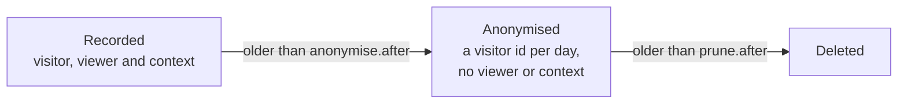
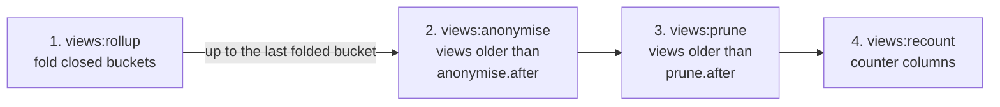
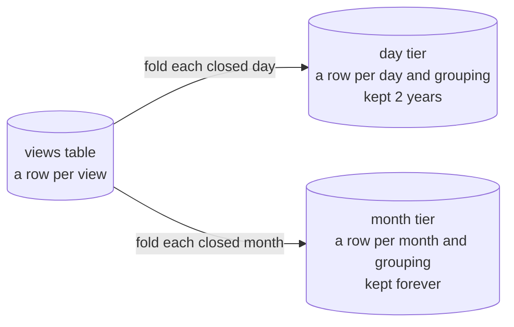
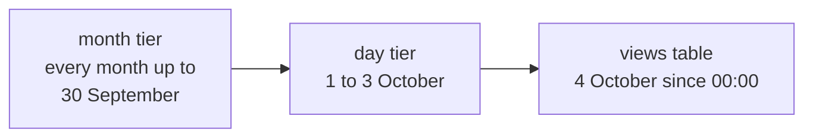
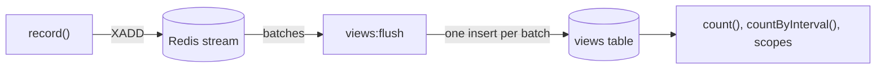

<div align="center">
  <a href="https://github.com/cyrildewit/eloquent-viewable">
    
  </a>
  <h3 align="center">Eloquent Viewable</h3>
  <p align="center">
    A minimalistic analytics package for Laravel with seamless view tracking for Eloquent models
  </p>
  <br/>
  <p align="center">
    <a href="https://packagist.org/packages/cyrildewit/eloquent-viewable"></a>        
      <a href="https://packagist.org/packages/cyrildewit/eloquent-viewable"></a>
      <a href="https://github.com/cyrildewit/eloquent-viewable/actions"></a>
      <a href="https://packagist.org/packages/cyrildewit/eloquent-viewable"></a>
      <a href="https://codecov.io/gh/cyrildewit/eloquent-viewable"></a>
  </p>
</div>
<hr/>
<details>
  <summary>Table of Contents</summary>
  <ol>
    <li><a href="#introduction">Introduction</a>
      <ul>
        <li><a href="#start-simple-scale-when-you-need-to">Start simple, scale when you need to</a></li>
      </ul>
    </li>
    <li><a href="#getting-started">Getting Started</a>
      <ul>
        <li><a href="#version-compatibility">Version Compatibility</a></li>
        <li><a href="#installation">Installation</a></li>
        <li><a href="#ai-coding-assistants">AI coding assistants</a></li>
      </ul>
    </li>
    <li><a href="#usage">Usage</a>
      <ul>
        <li><a href="#preparing-your-model">Preparing your model</a></li>
        <li><a href="#recording-views">Recording views</a></li>
        <li><a href="#queueing-view-recording">Queueing view recording</a></li>
        <li><a href="#setting-a-cooldown">Setting a cooldown</a></li>
        <li><a href="#recording-without-a-cookie">Recording without a cookie</a></li>
        <li><a href="#retrieving-view-counts">Retrieving view counts</a></li>
        <li><a href="#ordering-and-filtering-models-by-view-count">Ordering and filtering models by view count</a></li>
        <li><a href="#most-viewed-across-the-app">Most viewed across the app</a></li>
        <li><a href="#trending-right-now">Trending right now</a></li>
        <li><a href="#get-view-counts-of-models-you-already-have">Get view counts of models you already have</a></li>
        <li><a href="#view-collections">View collections</a></li>
        <li><a href="#who-viewed-what">Who viewed what</a></li>
        <li><a href="#erasing-one-persons-views">Erasing one person's views</a></li>
        <li><a href="#storing-context-with-a-view">Storing context with a view</a></li>
        <li><a href="#remove-views-on-delete">Remove views on delete</a></li>
        <li><a href="#caching-view-counts">Caching view counts</a></li>
      </ul>
    </li>
    <li><a href="#samples">Samples</a></li>
    <li><a href="#testing">Testing</a></li>
    <li><a href="#optimizing">Optimizing</a>
      <ul>
        <li><a href="#database-indexes">Database indexes</a></li>
        <li><a href="#retention">Retention</a></li>
        <li><a href="#rollups">Rollups</a></li>
        <li><a href="#purging-bot-views">Purging bot views</a></li>
        <li><a href="#partitioning-the-views-table">Partitioning the views table</a></li>
        <li><a href="#storing-counts-on-your-own-table">Storing counts on your own table</a></li>
        <li><a href="#buffering-views-in-redis">Buffering views in Redis</a></li>
      </ul>
    </li>
    <li><a href="#extending">Extending</a>
      <ul>
        <li><a href="#custom-information-about-visitor">Custom information about visitor</a></li>
        <li><a href="#using-your-own-view-eloquent-model">Using your own View Eloquent model</a></li>
        <li><a href="#customizing-how-views-are-created">Customizing how views are created</a></li>
        <li><a href="#choosing-where-views-are-stored">Choosing where views are stored</a></li>
        <li><a href="#adding-a-recording-guard">Adding a recording guard</a></li>
        <li><a href="#customizing-how-views-are-counted">Customizing how views are counted</a></li>
        <li><a href="#writing-a-trending-curve">Writing a trending curve</a></li>
        <li><a href="#adding-a-bucket-grammar-for-another-database-driver">Adding a bucket grammar for another database driver</a></li>
        <li><a href="#using-a-custom-crawler-detector">Using a custom crawler detector</a></li>
        <li><a href="#adding-macros-to-the-views-class">Adding macros to the Views class</a></li>
      </ul>
    </li>
    <li><a href="#upgrading">Upgrading</a></li>
    <li><a href="#changelog">Changelog</a></li>
    <li><a href="#contributing">Contributing</a></li>
    <li><a href="#credits">Credits</a></li>
  </ol>
</details>

## Introduction

**Eloquent Viewable** is a flexible and minimalistic analytics package for Laravel that allows seamless tracking of
views for Eloquent models. Rather than incrementing a single counter, it stores each view as its own database record,
so you can analyze totals, unique visitors, and custom time periods entirely within your own application. Whether
you're running a blog, an e-commerce store, or a custom Laravel application, this package lets you log and analyze
views without relying on external analytics services.

### Quick Example

Once installed, you can track and retrieve views effortlessly:

```php
// Record a view
views($post)->record();

// Return total view count
views($post)->count();

// Return unique view count of the past 7 days, compared with the 7 days before
views($post)->unique()->period(Period::pastDays(7))->compare();

// Daily counts for a chart
views($post)->period(Period::pastDays(30))->countByInterval(Granularity::Day);
```

### Key Features

- Track **total** and **unique** views for any Eloquent model, from a controller, a route middleware or the browser
  when the page comes from a full-page cache
- Query views by custom periods, compare with the previous period and group them **per hour, day, week, month or year**
- Order and filter models by views, rank the **most viewed content** across every model, and find what's **trending
  right now**
- Know **who viewed what** by linking views to the signed-in user
- Prevent duplicate views with a configurable **cooldown system**
- Count unique visitors **without a cookie**, with a daily rotating fingerprint
- Ignore views from **crawlers, blocked IPs, prefetches, and visitors who opt out** with Do Not Track or Global Privacy
  Control
- Scale with **caching, queued recording or a Redis buffer**, and test with `Views::fake()`

### Start simple, scale when you need to

Out of the box every view is one insert during the request and every count is one query. That is fine for most
applications and needs nothing beyond the migration. When traffic grows, switch on what you need, one config key at a
time. None of these changes how you query.

| Option                                                  | What you gain                                                    | What you need                                     |
|---------------------------------------------------------|------------------------------------------------------------------|---------------------------------------------------|
| Default                                                 | Views count immediately, nothing to set up                       | The migration                                     |
| [`remember()`](#caching-view-counts)                    | Repeated counts, series and rankings served from the cache       | Any cache store                                   |
| [Queued recording](#queueing-view-recording)            | The insert moves out of the request                              | A queue worker                                    |
| [Redis buffer](#buffering-views-in-redis)               | One Redis write per request, one insert per thousand views       | Redis 7+ and a scheduled `views:flush`            |
| [Optional indexes](#database-indexes)                   | Faster unique counts and counts over a whole model type          | A migration of your own                           |
| [Counts on your own table](#storing-counts-on-your-own-table) | Fast sorting of large lists by views                       | A column and a scheduled `views:maintain`         |
| [Cache cooldowns](#setting-a-cooldown)                  | Cooldowns on stateless API routes                                | Any shared cache store                            |
| [Fingerprint identity](#recording-without-a-cookie)     | Unique visitors without setting a cookie                         | A shared cache store, trusted proxies configured  |
| [Retention](#retention)                                 | Old views anonymised and deleted on a schedule                   | A migration and a scheduled `views:maintain`      |
| [Rollups](#rollups)                                     | History and cheap all-time counts after views are deleted        | A migration and the `rollup` source               |

## Getting Started

### Version Compatibility

| Package Version                                                            | Laravel    | PHP  |
|----------------------------------------------------------------------------|------------|------|
| [9.x](https://packagist.org/packages/cyrildewit/eloquent-viewable#9.x-dev) | 13.x       | 8.5+ |
| [8.x](https://packagist.org/packages/cyrildewit/eloquent-viewable#8.x-dev) | 13.x       | 8.5+ |
| [7.x](https://packagist.org/packages/cyrildewit/eloquent-viewable#7.x-dev) | 6.x – 13.x | 7.4+ |

The package supports [Laravel Octane](https://laravel.com/docs/octane). Nothing about one request, such as its
visitor, viewer, cooldowns or config, carries over to the next request a worker handles.

Lumen is not supported. Its last release is built on Laravel 11, and the package needs Laravel 13.

### Installation

Install the package via Composer, publish the migration and run it:

```bash
composer require cyrildewit/eloquent-viewable:^9
php artisan vendor:publish --provider="CyrildeWit\EloquentViewable\EloquentViewableServiceProvider" --tag="migrations"
php artisan migrate
```

Optionally publish the config file:

```bash
php artisan vendor:publish --provider="CyrildeWit\EloquentViewable\EloquentViewableServiceProvider" --tag="config"
```

#### Models keyed by UUID or ULID

The migration follows your application's morph key type, so if you already call `Schema::morphUsingUuids()` or
`Schema::morphUsingUlids()` it needs no changes. Otherwise edit the published migration before running it:

```php
$table->uuidMorphs('viewable');         // or ulidMorphs('viewable')
$table->nullableUuidMorphs('viewer');   // or nullableUlidMorphs('viewer'), to match your user model
```

All viewable models share one `viewable_id` column, so they need the same key type.

### AI coding assistants

The package ships guidelines and an `eloquent-viewable-development` skill for [Laravel Boost](https://laravel.com/docs/boost),
so coding agents record and count views the way this README describes. Pick the package when `boost:install` asks, or
add it to an existing setup:

```bash
php artisan boost:update --discover
```

## Usage

### Preparing your model

Implement the `Viewable` interface and use the `InteractsWithViews` trait:

```php
use Illuminate\Database\Eloquent\Model;
use CyrildeWit\EloquentViewable\Concerns\InteractsWithViews;
use CyrildeWit\EloquentViewable\Contracts\Viewable;

class Post extends Model implements Viewable
{
    use InteractsWithViews;
}
```

### Recording views

Record a view in the controller method that shows the model:

```php
public function show(Post $post)
{
    views($post)->record();

    return view('post.show', compact('post'));
}
```

`record()` returns `true` when the view was stored or queued and `false` when a guard refused it. The guards are listed
under `recording.guards` in the config. Out of the box they drop crawlers, requests without a user agent, `HEAD`
requests, browser prefetches, bursts of views from one visitor and the addresses in `recording.ignored_ip_addresses`,
and enforce cooldowns. See
[the guards](#adding-a-recording-guard) for the ones you can turn on, or add your own.

> [!NOTE]
> Tools like **Postman** are often detected as crawlers, so keep `IgnoreCrawlers` in mind when testing.

#### Recording from a route

Or leave the controller alone and add the `views` middleware to the route:

```php
Route::get('/posts/{post}', ShowPost::class)->middleware('views');
```

It records the last route parameter bound to a `Viewable` model, and only for a successful response to a `GET`
request, so a 404, a redirect or a form post records nothing. Name a parameter or a model class to pick another, and
pass options the same way:

```php
use CyrildeWit\EloquentViewable\Http\Middleware\RecordViews;

->middleware('views:user')                                    // the {user} parameter
->middleware(RecordViews::using(Post::class))                 // every parameter bound to a Post
->middleware(RecordViews::using(['user', 'post']))            // both
->middleware(RecordViews::using('post', collection: 'amp', cooldown: 30, queue: true))
```

A parameter that does not resolve to a `Viewable` throws `InvalidViewable` on the first request. A failed write is
reported and the page is still sent. For a condition, a `viewedBy()` or a `context()`, call `views()` in the controller.

> [!TIP]
> Inertia and Livewire reload a page with another `GET` to the same route. A `cooldown` keeps those reloads from
> adding views.

#### Recording from the browser

A page served from a full-page cache, such as `spatie/laravel-responsecache`, Cloudflare or Varnish, never reaches your
controller, so neither `record()` nor the middleware runs. Turn on the beacon and let the browser record the view:

```php
// config/eloquent-viewable.php
'recording' => [
    'beacon' => [
        'enabled' => true,
    ],
],
```

```blade
@viewsBeacon($post)
@viewsBeacon($post, collection: 'amp', cooldown: 30, queue: true)
```

Once the page has loaded, or a prerendered page is shown, its script posts to a signed URL and the view passes the same
guards as `record()`. The URL is the same for every visitor, never expires and is signed without the host, so it is safe
to cache with the page and behind a proxy.

- **Same origin only.** The route runs the `web` group, so cooldowns, the visitor cookie and the signed-in viewer work
  as usual, and the cookie is set on the beacon's response rather than the cached page. Laravel's CSRF check accepts
  the beacon through the browser's `Sec-Fetch-Site` header and refuses posts from other sites. Browsers that do not
  send it, such as Safari before 16.4, are not counted.
- **A neutral path.** The route lives under `/_ev`, because privacy filter lists block paths such as `/beacon` or
  `/track`. Change `prefix` if it collides with a route of your own, and `middleware` to run other middleware.
- **Quiet answers.** A changed URL gets a `403`, a deleted model a `404` and everything else a `204`, also when a guard
  skips the view.
- **Your own script.** For a single-page app, build the URL with
  `app(\CyrildeWit\EloquentViewable\Http\Beacon::class)->url($post, collection: 'amp')`.
- **Morph map.** The URL names the model by its morph class. Call `Relation::enforceMorphMap()` to show `post` instead
  of `App\Models\Post`.

#### Finding out why a view was not recorded

`attempt()` records like `record()` but returns a `Recording\Data\RecordResult`:

```php
use CyrildeWit\EloquentViewable\Recording\Guards\EnforceCooldown;

$result = views($post)->attempt();

$result->recorded;   // true when the view was stored or queued
$result->queued;     // true when the write was handed to the queue
$result->skippedBy;  // the guard that refused the view, or null

$result->wasSkippedBy(EnforceCooldown::class);
```

Each refusal also dispatches `Recording\Events\ViewSkipped` with the attempt and the guard, so you can log skipped views
without touching the code that records them.

Every attempt, stored, queued or skipped, also dispatches `Recording\Events\ViewAttempted` with the attempt and its
`RecordResult`. It fires in the request that made the attempt, also when the write is queued. The package only builds
the event when something listens to it, so it costs nothing otherwise.

#### Seeing it in Debugbar and Telescope

With [Laravel Debugbar](https://github.com/fruitcake/laravel-debugbar) 4.4 or newer installed, a **Viewable** tab lists
every view of the request: the ones stored, the ones queued and the ones skipped, with the guard that refused each,
the collection, the viewer and the context. Nothing to set up: the tab appears whenever Debugbar is collecting. To
leave it out, turn it off in `config/debugbar.php`:

```php
'collectors' => [
    // ...
    'eloquent_viewable' => false,
],
```

[Laravel Telescope](https://laravel.com/docs/telescope) needs nothing either. Its events watcher records
`ViewAttempted` and `ViewSkipped` like any other event of your application, with the guard named by its class.

### Queueing view recording

Move the insert to a queue worker to keep busy pages fast. Queue a single view, or every view from the config:

```php
views($post)->queue()->record();
views($post)->queue(false)->record(); // record synchronously when queueing is on globally
```

```php
'recording' => [
    'queue' => [
        'enabled' => true,
        'connection' => null,   // null uses the default queue connection
        'queue' => null,        // null uses the connection's default queue
    ],
],
```

The guards still run during the request, so bots and views on cooldown are never queued. Leave queueing off when you
use the [Redis buffer](#buffering-views-in-redis), which already moves the write out of the request.

> [!WARNING]
> A queued view dispatches `ViewRecorded` from the worker, where the session, cookies, `request()` and `auth()` are
> unavailable. Read what you need from `$event->record`, which carries the viewer and the
> [context](#storing-context-with-a-view) captured during the request.

### Setting a cooldown

A cooldown ignores repeated views of the same model by the same visitor for a number of minutes, or until a given time:

```php
views($post)->cooldown(30)->record();
views($post)->cooldown(now()->addHours(3))->record();
```

While a cooldown runs, `record()` returns `false` and `attempt()` reports `EnforceCooldown`. Two requests that arrive at
the same moment may both be recorded.

Cooldowns are kept in the session by default, so they do nothing on routes without one, such as stateless API routes.
Set `cooldown.store` to `cache` to keep them in a cache store instead:

```php
'cooldown' => [
    'store' => 'cache',
    'cache' => [
        'store' => 'redis', // null uses the default cache store
    ],
],
```

To add a store, implement `Cooldowns\Contracts\CooldownStore` and register it with
`CooldownManager::extend()` in a service provider.

### Recording without a cookie

By default each guest gets a cookie with a random id, which `unique()` counts and cooldowns are keyed on. Set
`visitor.identity` to `fingerprint` to identify guests without one:

```php
'visitor' => [
    'identity' => 'fingerprint',
    'fingerprint' => [
        'store' => 'redis', // null uses the default cache store
    ],
],
```

The visitor id becomes an HMAC of the truncated IP address (/24 for IPv4, /48 for IPv6) and the user agent, keyed with a
salt that rotates at midnight. Neither the IP address nor the user agent is stored, and once the salt is gone a hash
cannot be traced back. Signed-in users are identified by their account instead, as with the
[`viewer` identity](#counting-one-account-as-one-visitor).

The trade-offs compared to the cookie:

- **`unique()` counts visitors per day.** The same guest on Monday and Tuesday counts twice over a week.
- **Cooldowns end at midnight** at the latest.
- **Visitors sharing a network and browser count as one**, so unique counts come out lower. Totals are unaffected.
- **Configure trusted proxies** behind a load balancer or CDN, or every visitor hashes the same address.
- **Every server needs the same cache store** for the salt. The `array` store does not work.
- **Use the `cache` cooldown store**, because the `session` store still sets the session cookie.

Whether you need consent depends on your jurisdiction and the rest of your application, not only on this package.

### Retrieving view counts

```php
views($post)->count();
views($post)->unique()->count();
views(Post::class)->count();            // every post together, also views(new Post)
```

#### Periods

Narrow a count to a period:

```php
use CyrildeWit\EloquentViewable\Support\Period;

views($post)->period(Period::create('2017-01-01', '2018-01-01'))->count();
```

A period includes its start and excludes its end, so `Period::create('2018-01-01', '2018-02-01')` is January.

```php
Period::create($start, $end);
Period::since($start);
Period::upto($end);                    // up to, but not including

Period::pastDays(7);                   // from midnight 7 days ago, also pastWeeks, pastMonths, pastYears
Period::subHours(6);                   // from now minus 6 hours, also subSeconds, subMinutes, subDays, ...
Period::pastDays(7, 'Australia/Sydney'); // from midnight in that timezone
```

`Period::parse()` reads the short forms a dashboard puts in a URL, and `Period` binds as a route parameter, responding
with a 404 to anything it cannot read:

```php
Period::parse('7d');                       // pastDays(7), likewise 3w, 6m, 1y
Period::parse('12h');                      // subHours(12), likewise 30min and 90s
Period::parse('2026-01-01..2026-02-01');   // create(), and '2026-01-01..' or '..2026-02-01' for open ends

Route::get('/posts/{post}/stats/{period}', fn (Post $post, Period $period) => views($post)->period($period)->count());

route('posts.stats', [$post, Period::pastDays(7)]); // /posts/1/stats/7d
```

`viewed_at` is stored in your application timezone. Keep `app.timezone` at `UTC` unless you have a reason not to.

#### Compare with the previous period

`compare()` counts the period and the one right before it, of the same width:

```php
$trend = views($post)->period(Period::pastDays(7))->compare();

$trend->current;        // 340
$trend->previous;       // 290
$trend->delta;          // 50
$trend->percent;        // 17.2, or null when there were no views before
$trend->previousPeriod; // Period, for a "compared with 20–27 Aug" label
```

The result is `JsonSerializable`, so a controller can return it. A period without both bounds, such as
`Period::since()`, has no width and throws `InvalidPeriod`.

#### Get view counts grouped by interval

`countByInterval()` returns the count per hour, day, week, month or year, with empty buckets filled in with zero:

```php
use CyrildeWit\EloquentViewable\Support\Granularity;

$series = views($post)
    ->period(Period::pastDays(30))
    ->countByInterval(Granularity::Day);

$series->labels();  // ['2026-09-01', '2026-09-02', ...]
$series->values();  // [14, 22, ...]
$series->total();   // the same number as count() over the period
$series->peak();    // the busiest Bucket, with start, end, label and count
```

The series is `JsonSerializable`, so it feeds a chart straight from a controller. Buckets follow the calendar, weeks
start on Monday, and `views($post)->period($bucket->period())->count()` gives the same number as the bucket.

Buckets follow your application timezone. Pass `timezone('Australia/Sydney')` to start each day at Sydney midnight;
daylight saving transitions are handled without timezone tables in the database. A call that would produce more than
`querying.max_intervals` buckets (10,000 by default) throws `InvalidInterval`.

Grouping happens in the database, with a grammar for SQLite, MySQL, MariaDB and Postgres. Other drivers need
[a grammar of their own](#adding-a-bucket-grammar-for-another-database-driver).

#### Get view counts per collection

```php
views($post)->countByCollection();
// ['' => 1200, 'sidebar' => 340, 'feed' => 88], most viewed first, '' for views without a collection
```

#### Combining

Every option combines with every way of counting: `unique()`, `period()`, `collection()`, `viewedBy()`, `timezone()` and
`remember()` work with `count()`, `compare()`, `countByInterval()`, `countByCollection()`, `counts()` and `top()`.

### Ordering and filtering models by view count

```php
Post::orderByViews()->get();                                        // most viewed first
Post::orderByViews('asc')->get();
Post::orderByUniqueViews('desc', Period::pastDays(3))->get();
Post::orderByViews('desc', null, 'custom-collection')->get();

Post::whereViewsCount('>=', 1000)->get();
Post::whereUniqueViewsCount('>=', 50, Period::pastDays(30))->get();
Post::whereViewsCount('>=', 100)->orderByViews()->get();
```

`whereViewsCount()` takes the same period and collection arguments, counts a model without views as zero, and accepts
`=`, `!=`, `<>`, `<`, `<=`, `>` and `>=`. Both scopes run a subquery per row, so narrow the query where you can. To
only check whether a model has any views, `Post::has('views')` is cheaper. For large lists, see
[storing counts on your own table](#storing-counts-on-your-own-table).

### Most viewed across the app

`Views::top()` ranks the most viewed content across every model type:

```php
use CyrildeWit\EloquentViewable\Facades\Views;

$ranking = Views::period(Period::pastDays(7))->top(5);

foreach ($ranking as $entry) {
    $entry->rank;      // 1, 2, 3, ...
    $entry->count;     // the number of views
    $entry->viewable;  // a Post, a Video, ... whichever model it is
}

views(Post::class)->top(10);  // within one model
```

The models are loaded with one query per type and never cached, so a `remember()`ed ranking shows fresh attributes. A
model that can no longer be loaded, for example because it was deleted, is left out, so a ranking can hold fewer
entries than the limit. The ranking serializes to JSON as `rank`, `count` and `viewable`, and `score` for
[trending](#trending-right-now) rankings.

### Trending right now

`top()` ranks by how many views something got in a period, and every view in that period counts the same.
`trending()` ranks by how many views something is getting *now*: a recent view counts fully and an older one counts
less the older it gets. Something that's taking off this hour ranks above something that was busy last week.

```php
$trending = views(Post::class)->trending(10);

foreach ($trending as $entry) {
    $entry->rank;      // 1, 2, 3, ...
    $entry->viewable;  // the post
    $entry->count;     // its views in the window, for a "1,234 views" label
    $entry->score;     // its views weighed by age, see below
}

Views::trending(10);   // across every model type
```

#### How the ranking is made

Every view gets a weight between 1 and 0, depending on its age, and a model's score is the sum of those weights. By
default a view loses half its weight every day. A view from now counts as 1, one from yesterday as 0.5, and one from a
week ago as less than 0.01.

Say three posts got these views:

| Post          | Views              | `top()` over 7 days | `trending()` score |
|---------------|--------------------|---------------------|--------------------|
| Queues guide  | 1,000, 6 days ago  | 1st, 1,000          | 3rd, about 16      |
| Release notes | 800, the past hour | 2nd, 800            | 1st, about 800     |
| Redis tips    | 400, yesterday     | 3rd, 400            | 2nd, about 200     |

`top()` still puts the Queues guide first, a week after everyone stopped reading it. `trending()` puts the release
notes first, the moment they take off, and lets the Queues guide fade out gradually instead of dropping off at the end
of the window.

Read the score as "worth this many views right now". Use it to sort, chart or set a threshold, such as showing a badge
above 50, but don't show it as a view count. That's what `count` is for.

#### Choosing how fast views fade

The half-life is how long a view takes to lose half its weight. A short one reacts fast and forgets fast. A long one
favours steady traffic. Set it once in the config:

```php
'querying' => [
    'trending' => [
        'half_life' => '1d', // news, social: what's hot today
        // 'half_life' => '1w', // a shop or catalogue: what's in demand lately
    ],
],
```

or for one call with `trending(halfLife: CarbonInterval::hours(6))`.

The half-life is a setting of exponential decay, the default curve. Two other curves ship with the package:

| A view of this age weighs  | now | 1 day | 3 days | 6 days | 7 days |
|----------------------------|-----|-------|--------|--------|--------|
| `ExponentialDecay`, 1 day  | 1   | 0.5   | 0.13   | 0.02   | 0.01   |
| `ExponentialDecay`, 1 week | 1   | 0.91  | 0.74   | 0.55   | 0.5    |
| `LinearDecay`, 7 days      | 1   | 0.86  | 0.57   | 0.14   | 0      |
| `Window`, 7 days           | 1   | 1     | 1      | 1      | 0      |

- **`ExponentialDecay`**, the default, suits most lists. It never drops anything abruptly.
- **`LinearDecay`** fades evenly to zero at the end of its window, for "this week" lists that should forget the
  previous week completely.
- **`Window`** counts every view in the window the same. That's `top()`, but with a `score`, for when one list should
  switch between the two.

```php
use CyrildeWit\EloquentViewable\Querying\Ranking\Curves\LinearDecay;

views(Post::class)->trending(curve: new LinearDecay(CarbonInterval::days(7)));
```

To use another curve everywhere, set `querying.trending.curve` to its class. To write your own, see
[Writing a trending curve](#writing-a-trending-curve).

#### Ordering models by trending

To paginate, filter or eager load, use the scopes:

```php
Post::where('published', true)->orderByTrending()->paginate(20);
Post::withTrendingScore()->get();                       // adds `trending_score`
Post::orderByTrending(halfLife: CarbonInterval::days(7), collection: 'amp')->get();
```

They take the same `period`, `collection`, `unique` and `as` arguments as `orderByViews()`, plus `halfLife` and
`curve`. A post without recent views scores 0.

#### Narrowing it down

```php
views(Post::class)->period(Period::pastDays(3))->trending();    // only views of the past 3 days
views(Post::class)->period(Period::create('2026-09-01', '2026-10-01'))->trending(); // trending in September
views(Post::class)->collection('amp')->trending();
views(Post::class)->unique()->trending();                       // visitors instead of views
```

Without a period, views count until they weigh almost nothing: eight half-lives, so eight days by default. The end of
the period is the "now" that ages are measured from.

#### Good to know

- **Give `remember()` a lifetime.** A ranking remembered forever never changes. Ten minutes is plenty for a sidebar:
  `remember(10)`.
- **The ranking moves once an hour.** Views are weighed per hour, or per day for a window too long for hours. A view
  from 10:05 and one from 10:55 weigh the same.
- **`unique()` counts a visitor once per hour**, or once per day when views are weighed per day. A reader who comes
  back the next day counts again, which is what makes something trending.
- **Scores compare only under the same curve.** A one-day and a one-week half-life give different scores for the same
  views.

#### On large tables

`trending()` reads the same rows as `top()` over the same window, so the `(viewable_type, viewable_id, viewed_at)`
index from the migration covers it. With the [`rollup` source](#rollups), the hourly tier is used when you keep one. A
day tier alone can't tell hours apart, so with hourly weighing those reads come from the `views` table. Keep an `hour`
tier for as long as your trending window, or set `querying.trending.step` to `'1d'`.

### People who viewed this also viewed

Show related content based on what your visitors actually do, such as a "Readers also read" box under an article or
"Customers also viewed" on a product page. `alsoViewed()` looks at everyone who viewed a model and finds what else
those people viewed:

```php
$related = views($post)->alsoViewed(5);
```

```blade
@foreach ($related as $entry)
    <a href="{{ route('posts.show', $entry->viewable) }}">{{ $entry->viewable->title }}</a>
@endforeach
```

#### How the ranking is made

Say three visitors read your post about Laravel queues:

| Visitor | Also viewed                |
|---------|----------------------------|
| Alice   | Redis guide, Horizon video |
| Bob     | Redis guide                |
| Carol   | Redis guide, Horizon video |

`views($queuesPost)->alsoViewed()` ranks the Redis guide first with a count of 3, because all three visitors viewed
it, and the Horizon video second with a count of 2. A visitor who viewed something many times still counts once, and
the post itself is never in the list.

Each entry has the model and that count:

```php
foreach (views($post)->alsoViewed(5) as $entry) {
    $entry->rank;      // 1, 2, 3, ...
    $entry->count;     // how many visitors viewed both
    $entry->viewable;  // a Post, a Video, ... whichever model it is
}
```

#### Narrowing it down

```php
views($post)->alsoViewed(5, among: Post::class);           // only posts
views($post)->period(Period::pastDays(30))->alsoViewed(5);  // only recent views
views($post)->collection('sidebar')->alsoViewed(5);         // only one collection
views($post)->remember(now()->addHour())->alsoViewed(5);    // cached
```

The period and collection apply to both sides: the views of the post and the views of everything else.
`forgetCache()` on the post also forgets its cached ranking.

#### Good to know

- **Something needs at least 3 visitors in common to show up.** This keeps the list from exposing what one or two
  people looked at, and keeps noise out. Change it with `querying.also_viewed.minimum_visitors`. On a fresh site with
  little traffic, the list stays empty until enough people have visited.
- **"The same visitor" follows your [visitor identity](#counting-one-account-as-one-visitor).** With the default cookie
  it is one browser, with `viewer` one account across devices. With `fingerprint`, and on views older than
  `retention.anonymise.after`, a visitor is only recognised within a single day.
- **Popular content shows up everywhere.** Your homepage or most-read article is viewed by almost everyone, so it
  tends to rank high next to any post. Use `among:` or filter the results if that gets in the way.
- **It counts visitors.** `unique()` changes nothing and `viewedBy()` is refused. To list what one user viewed, use
  [`whereViewedBy()`](#which-models-a-viewer-has-seen).

#### On large tables

To find the other views, the query reads every view of every visitor of the post. Two things keep that fast:

- **The visitor index.** Add `(visitor, viewed_at, viewable_type, viewable_id)` from
  [Database indexes](#database-indexes). Without it, every call scans the whole `views` table.
- **The visitor cap.** Only the 1,000 most recent visitors of the post are read. Change it with
  `querying.also_viewed.max_visitors`, or set it to `null` to read every visitor.

For heavy traffic, compute the rankings from a scheduled command into a table of your own instead of on every request.
The `rollup` source reads them from the `views` table, so they only cover the views it still holds.

### Get view counts of models you already have

For a page of results you already loaded, `forViewables()` counts them all in one query instead of one per model:

```php
$posts = Post::query()->latest()->paginate(20);

$counts = Views::forViewables($posts)->period(Period::pastDays(7))->counts();

$counts[$post->getKey()]; // 0 for a post without views
```

It takes any collection, paginator or array of saved models of one type. With `remember()`, only the models missing
from the cache are counted.

### View collections

Store different kinds of views of the same model in their own collection, and count them the same way:

```php
views($post)->collection('customCollection')->record();
views($post)->collection('customCollection')->count();
```

### Who viewed what

A view can be linked to the signed-in model through the polymorphic `viewer_type` and `viewer_id` columns, so any model
can be a viewer. Guests leave them `null`.

#### Recording the viewer

Recording the viewer is off by default, because it ties a view to an identity. Turn it on in the config; `guard` names
the auth guard, and `null` means the default one:

```php
'recording' => [
    'viewer' => [
        'enabled' => true,
        'guard' => null,
    ],
],
```

To credit a view to a model yourself, for example in a console command, use `viewedBy()`. It works whether or not the
switch is on. A queued view keeps its viewer.

```php
views($post)->viewedBy($user)->record();
```

#### Counting the views of one viewer

```php
views($post)->viewedBy($user)->count();
views(Post::class)->viewedBy($user)->period(Period::pastDays(7))->count(); // every post
```

#### Counting one account as one visitor

By default `unique()` counts browsers, so a user on three devices counts three times. Set `visitor.identity` to `viewer`
to count signed-in users by their account instead. Guests keep the cookie id.

```php
'visitor' => [
    'identity' => 'viewer',
],
```

The id is an HMAC of the model with `app.key`, so rotating the application key splits the unique counts of signed-in
users at that moment. A guest who signs in counts as two visitors.

#### Which models a viewer has seen

```php
Post::whereViewedBy($user)->get();
Post::whereNotViewedBy($user)->get();                       // the unread ones
Post::whereViewedBy($user, Period::pastDays(7))->get();
Post::whereNotViewedBy($user, collection: 'sidebar')->get();

Post::whereNotViewedByVisitor($visitorId)->get();          // for guests, by visitor id
```

#### The viewer side

Add the optional `HasViewHistory` trait to the model that views things:

```php
use CyrildeWit\EloquentViewable\Concerns\HasViewHistory;

class User extends Authenticatable
{
    use HasViewHistory;
}

$user->viewed()->with('viewable')->paginate();   // what they looked at, newest first
$user->hasViewed($post, Period::pastDays(7));    // bool
$user->lastViewedAt($post);                      // Carbon or null
```

Each `View` also has a `viewer` relation and `byViewer()` and `byVisitor()` scopes.

### Erasing one person's views

For a deleted account or a GDPR request, `HasViewHistory` erases or exports everything one viewer recorded:

```php
$user->forgetViewHistory();                          // delete their views
$user->forgetViewHistory(includeGuestViews: true);   // and the guest views of the browsers they signed in on
$user->anonymiseViewHistory();                       // keep the counts, take out what ties the views to them
$user->exportViewHistory();                          // their views, for a data access request
```

There is no foreign key, so a deleted user's views keep pointing at a model that is gone. Call one of these before
deleting the user, or name the viewer afterwards from the command line. A guest is named by their visitor id, the value
of the visitor cookie:

```bash
php artisan views:forget-viewer "App\Models\User" 42
php artisan views:forget-viewer user 42 --with-visitors   # a morph alias works too
php artisan views:forget-visitor 5f2a…
```

Both commands take `--chunk` and ask for confirmation in production unless given `--force`. In code,
`Erasure\Subject::viewerKey($type, $key)` and `Subject::visitor($id)` name the same people for the actions in
`Erasure\Actions`.

`exportViewHistory()` returns a lazy collection of the views, oldest first, so a long history is read in chunks:

```php
$user->exportViewHistory()->toJson();
// [{"viewable_type":"App\\Models\\Post","viewable_id":12,"collection":null,"context":{"source":"newsletter"},"viewed_at":"2026-10-01T09:12:00+00:00"}]
```

What to know:

- **A viewer is also found by its visitor id.** With `visitor.identity` set to `viewer` or `fingerprint`, the visitor id
  of a signed-in view is derived from the account. Views whose viewer columns were cleared by hand are still found.
- **Guest views are kept by default.** With the default cookie identity, a user's views share the cookie id with the
  views that browser made before they signed in. `includeGuestViews` and `--with-visitors` delete those as well, which
  on a shared computer can be someone else's.
- **Anonymising works like [retention](#retention).** `viewer` and `context` become `null`, and `visitor` is re-hashed
  under a salt per day that is thrown away afterwards. Total views and daily unique visitors stay the same; unique
  counts across days count the person once per day.
- **Buffered views are reached too.** With the [Redis buffer](#buffering-views-in-redis), the person's views that have
  not been flushed yet are landed first. A [queued](#queueing-view-recording) view still in the queue lands afterwards.
- **Rollups are left alone.** [Rollups](#rollups) hold counts per bucket and no visitor or viewer, so a forgotten
  person's views stay counted in the history they were folded into. Counts read through the `rollup` source include
  them for every bucket folded before the erasure.
- **Remembered counts of the models they viewed are forgotten,** and every count once more than 100 models are touched.
  [Counter columns](#storing-counts-on-your-own-table) catch up on the next `views:recount`.
- **Each call dispatches an event** for your audit log, also when the person had no views:
  `Erasure\Events\ViewHistoryForgotten` and `ViewHistoryAnonymised` with the `subject` and the number of `views`, and
  `ViewHistoryExported` with the `subject`.

### Storing context with a view

Keep anything else with a view, such as a referrer, a source or a tenant, in the nullable `context` JSON column. The
package writes it and never reads it. A queued view keeps it.

```php
views($post)->context(['source' => request('src')])->record();

$post->views()->where('context->source', 'newsletter')->count();
```

A JSON path cannot use the table's indexes. If one key is queried often, add an indexed generated column for it in a
migration of your own.

### Remove views on delete

A model's views are deleted with it. A soft delete keeps them until `forceDelete()`. To keep the views, override
`shouldRemoveViewsOnDelete()`:

```php
public function shouldRemoveViewsOnDelete(): bool
{
    return false;
}
```

To drop the views of a soft-deleted model anyway, call `views($post)->destroy()`.

### Caching view counts

Add `remember()` to cache a count, a series or a ranking. The lifetime is forever by default:

```php
views($post)->remember()->count();
views($post)->remember(3600)->count();                          // for an hour
views($post)->remember(now()->addWeeks(2))->count();
views($post)->period(Period::pastDays(30))->remember()->countByInterval(Granularity::Day);
Views::period(Period::pastDays(7))->remember()->top(10);
```

Relative periods such as `Period::pastDays(30)` are cached too. Recording a view leaves a remembered count alone;
deleting views forgets it. To forget remembered counts yourself, for example after an import:

```php
views($post)->forgetCache();      // the post, its type and every ranking
views(Post::class)->forgetCache(); // every post
Views::flushCache();               // everything
```

This works on every cache store, including those without tags. For fresher counts, use a shorter lifetime.

## Samples

The sections above document each feature on its own. The [`samples`](samples) directory shows what they add up to:
complete features you would build in a real application, each one a few files you can read top to bottom and copy.

- [**Trending articles**](samples/TrendingArticles): a "Trending this week" sidebar with the ten articles taking off
  right now, recorded by middleware and ranked by views weighed by their age.
- [**Listing stats**](samples/ListingStats): a seller's stats page with a daily chart, unique visitors and the change
  against the 30 days before.
- [**Popular products**](samples/PopularProducts): a "Most viewed" sort that stays fast over millions of views,
  without slowing down the product page.
- [**Breaking news**](samples/BreakingNews): a story that a hundred thousand readers open within minutes, buffered in
  Redis instead of hitting the database on every request.
- [**Recently viewed**](samples/RecentlyViewed): "Continue where you left off" and "Not opened yet" rows for a
  signed-in learner.
- [**Content dashboard**](samples/ContentDashboard): one editors' page that answers "what worked this week" across
  guides and podcast episodes.
- [**Privacy-first analytics**](samples/PrivacyFirstAnalytics): counting readers of a docs site without cookies, IP
  addresses or a cookie banner.

Every sample comes with a Pest test that runs with the rest of the suite, so the code you copy is code that works.

## Testing

`Views::fake()` swaps storage for an in-memory fake, so a test records views without a `views` table and reads them
back through the same `views()` calls:

```php
use CyrildeWit\EloquentViewable\Facades\Views;
use CyrildeWit\EloquentViewable\Data\ViewRecord;

it('records a view of the post', function (): void {
    $fake = Views::fake();

    $this->get(route('posts.show', $post));

    $fake->assertRecorded($post);
    $fake->assertRecorded($post, 1);
    $fake->assertRecorded($post, fn (ViewRecord $record): bool => $record->collection === 'sidebar');
    $fake->assertNotRecorded($otherPost);
    $fake->assertNothingRecorded();
    $fake->assertForgotten($post);
});
```

The guards still run. Every count reads from the fake, but the scopes, `withViewsCount()`, `orderByViews()`,
`whereViewsCount()` and the `whereViewedBy()` family, need SQL and throw `Querying\Exceptions\UnsupportedBySource`.

For tests and seeders that need real rows, the `View` model ships a factory:

```php
use CyrildeWit\EloquentViewable\Models\View;

View::factory()->for($post, 'viewable')->count(3)->create();
View::factory()->for($post, 'viewable')->fromVisitor('visitor_one')->inCollection('sidebar')->create();
View::factory()->for($post, 'viewable')->viewedAt(now()->subDays(2))->by($user)->create();
```

## Optimizing

Every view is its own row, so the `views` table grows with traffic. The table in
[Start simple, scale when you need to](#start-simple-scale-when-you-need-to) lists what to switch on, and
[retention](#retention) and [rollups](#rollups) keep the table from growing forever. At tens of millions of views a
month, [partitioning](#partitioning-the-views-table) lets a whole month go at once.

The repository has a [benchmark suite](benchmarks) that times the expensive paths against millions of seeded views on
every supported database. The optional indexes below were measured with it.

### Database indexes

The migration indexes `(viewable_type, viewable_id)` and `(viewable_type, viewable_id, viewed_at)`, so period counts and
series only read the rows inside the period, and `viewed_at`, so retention and rollups scan by date. If you installed
before the last two existed, the [upgrade guide](UPGRADING.md#4-add-the-new-columns-and-indexes) has a migration for
them.

Three optional indexes, added in a migration of your own:

- `visitor` as a fourth column of that composite index, or `include (visitor)` on Postgres, speeds up `unique()` counts.
- `(viewable_type, viewed_at)` speeds up counts over a whole type within a period, such as
  `views(Post::class)->countByInterval()`.
- `(visitor, viewed_at, viewable_type, viewable_id)` lets `alsoViewed()` find the views of each visitor it pairs
  without scanning the table.

### Retention

The `views` table keeps every row, with the visitor id, the viewer and the context of each view. A retention policy
anonymises views once they reach one age and deletes them at another. Nothing is set out of the box.


```mermaid
flowchart LR
    recorded["Recorded<br/>visitor, viewer and context"]
    anonymised["Anonymised<br/>a visitor id per day,<br/>no viewer or context"]
    deleted["Deleted"]
    recorded -->|"older than anonymise.after"| anonymised
    anonymised -->|"older than prune.after"| deleted
```

Publish and run the migration, which adds an index on `viewed_at` and a small state table:

```bash
php artisan vendor:publish --provider="CyrildeWit\EloquentViewable\EloquentViewableServiceProvider" --tag="eloquent-viewable-retention"
php artisan migrate
```

Set the ages in the period shorthand and schedule one command:

```php
'retention' => [
    'anonymise' => ['after' => '30d', 'columns' => ['visitor', 'viewer', 'context']],
    'prune' => ['after' => '1y'],
],
```

```php
Schedule::command('views:maintain')->hourly()->onOneServer();
```

Each run takes the steps below in order and skips the ones that are not configured. The [rollups](#rollups) are folded
first, because anonymising and pruning never go past the last bucket they have folded.


```mermaid
flowchart LR
    rollup["1. views:rollup<br/>fold closed buckets"]
    anonymise["2. views:anonymise<br/>views older than<br/>anonymise.after"]
    prune["3. views:prune<br/>views older than<br/>prune.after"]
    recount["4. views:recount<br/>counter columns"]
    rollup -->|"up to the last folded bucket"| anonymise --> prune --> recount
```

`views:anonymise` and `views:prune` run one step, and take `--older-than=90d` in place of the configured age. Every
command takes `--dry-run` and `--chunk`. A dry run of `views:maintain` folds nothing, but counts the views to anonymise and delete
as if its rollups had been folded first, so it reports what the real run would change.

#### Keeping each run short

The first run after you turn retention or rollups on, or after `views:rollup --from`, catches up on everything at once.
On a large table that can take longer than the hour until the next scheduled run. Give the run a time limit:

```php
Schedule::command('views:maintain --max-seconds=1800')->hourly()->onOneServer();
```

Once the time is up, the run finishes the bucket, day or chunk it is working on and stops. The next run carries on from
there, in the same order, so a backlog is worked off over a few runs instead of in one very long one. Every maintenance
command takes `--max-seconds`.

On a host that cuts scheduled commands off after a few minutes, such as a serverless platform, dispatch the job
instead. It runs the same steps for at most `maxSeconds` and queues itself again while there is work left:

```php
use CyrildeWit\EloquentViewable\Maintenance\Jobs\MaintainViewsJob;

Schedule::job(new MaintainViewsJob(maxSeconds: 240))->hourly();
```

Keep `maxSeconds` below the timeout of your queue worker. Only one of these jobs waits in the queue at a time.

Anonymising re-hashes `visitor` under a salt per day. The same visitor keeps one id within a day and gets a new one the
next day:

| `viewed_at`    | `visitor` before | `visitor` after | `viewer` and `context` |
|----------------|------------------|-----------------|------------------------|
| 3 March, 09:12 | `5f2a…`          | `a:7f3c…`       | `null`                 |
| 3 March, 17:40 | `5f2a…`          | `a:7f3c…`       | `null`                 |
| 4 March, 08:05 | `5f2a…`          | `a:e19b…`       | `null`                 |

What to know:

- **Anonymising keeps daily uniques exact.** `viewer` and `context` become `null`, and `visitor` is re-hashed under a
  salt per day that is destroyed afterwards. One visitor keeps one id within a day but no id links two days, so
  `anonymise.after` is how far back unique counts across days stay exact. It must not be longer than `prune.after`.
- **A run holds a lock** on the `querying.cache.store` store, so two servers never run at once. A run that is still
  working renews the lock, so a long run keeps it, and the lock of a run that died expires after an hour.
- **A run forgets every remembered count** when it changed a view, and dispatches `Retention\Events\ViewsAnonymised`
  or `ViewsPruned`.
- **A command throws `Retention\Exceptions\RetentionNotInstalled`** when the migration has not run.

### Rollups

Rollups keep the counts of old views per bucket of time, so history outlives the views it was counted from and
all-time counts read a few rows per model instead of every view. Publish and run their migration, configure the tiers
and read through the `rollup` source:


```mermaid
flowchart LR
    views[("views table<br/>a row per view")]
    day[("day tier<br/>a row per day and grouping<br/>kept 2 years")]
    month[("month tier<br/>a row per month and grouping<br/>kept forever")]
    views -->|"fold each closed day"| day
    views -->|"fold each closed month"| month
```

```bash
php artisan vendor:publish --provider="CyrildeWit\EloquentViewable\EloquentViewableServiceProvider" --tag="eloquent-viewable-rollups"
php artisan migrate
```

```php
'querying' => [
    'source' => ['driver' => 'rollup'],
],

'retention' => [
    'rollups' => [
        'tiers' => ['day' => '2y', 'month' => null], // null keeps a tier forever
        'groupings' => ['viewable', 'viewable_collection', 'type'],
    ],
],
```

`views:maintain` folds closed buckets with `views:rollup` before it anonymises and prunes, so the same scheduler line
covers it. `views:rollup` also drops the buckets of a tier past its age, and takes `--tier`, `--from` to fold again
from a date, `--dry-run` and `--chunk`. Every read and scope works through the `rollup` source.

Each grouping answers one kind of count: `viewable` a model, `viewable_collection` a model within a collection, `type`
a whole model type, and `type_collection`, off by default, a type within a collection. A read that needs a grouping
that is not kept, or narrows to a viewer, reads the `views` table alone.

A read splits its period by where each part is kept and adds the parts up. With the tiers above, an all-time count at
15:00 on 4 October reads:


```mermaid
flowchart LR
    month["month tier<br/>every month up to<br/>30 September"]
    day["day tier<br/>1 to 3 October"]
    raw["views table<br/>4 October since 00:00"]
    month --> day --> raw
```

A `unique()` count reads the `views` table as far back as it still holds the original visitor ids, because unique
visitors cannot be added up across buckets exactly.

What to know:

- **Recent views and exact uniques come from the `views` table.** Older history comes from the coarsest tier that
  covers it.
- **Older history has the resolution of its tier.** A bucket counts when its start lies inside the period, and unique
  visitors are summed across buckets. With `retention.rollups.strict` such a read throws
  `Querying\Rollups\Exceptions\ResolutionUnavailable` instead.
- **Nothing is deleted before it is folded.** Anonymising and pruning stop at the last bucket every tier has folded, and
  a tier drops only buckets the next coarser tier has folded. Settings that would break this throw
  `InvalidConfiguration` at boot.
- **Late views are folded again.** A bucket waits `settle`, an hour by default, after it closes, and a view that lands
  later is found by its id and its bucket folded again.
- **Destroying views** removes the model's rollup rows, but not its share of the unique visitors of its type.

#### Custom rollups

A custom rollup counts only the views a filter keeps, in tiers and groupings of its own and per value of at most one
dimension. It is the only way a value from `context` outlives anonymising.

```php
use CyrildeWit\EloquentViewable\Querying\Rollups\Rollup;
use Illuminate\Database\Eloquent\Builder;

final class NewsletterViews extends Rollup
{
    public string $name = 'newsletter';

    public function tiers(): array
    {
        return ['day' => '2y', 'month' => null];
    }

    public function filter(Builder $views): void
    {
        $views->getQuery()->where('context->source', 'newsletter');
    }

    public function dimension(): ?string
    {
        return 'context->campaign';
    }
}
```

List it under `retention.rollups.custom` and read it with `rollup()`:

```php
views($post)->rollup('newsletter')->period(Period::pastYears(1))->count();
views($post)->rollup('newsletter')->countByDimension(); // ['spring' => 120, 'winter' => 45, '' => 8]
```

What to know:

- **Recent and old counts agree.** `rollup()` reads the `views` table through the same filter, so it works with the
  `database` source too.
- **Keep the dimension small.** Every value is a row per bucket. `groupings()` defaults to `viewable` and `type`.
- **Anonymising and pruning wait for every custom rollup.** `views:rollup --rollup=newsletter` folds one rollup.
- **A source of your own** counts by dimension by implementing `Querying\Contracts\CountsByDimension`, and the fake
  refuses `rollup()`.

### Purging bot views

`IgnoreBursts` stops a burst once it reaches the limit. `views:purge-bots` deletes the views that were recorded
anyway: the first views of a burst, and the views of tables that filled up before the guard existed.

```bash
php artisan views:purge-bots --since=30d --dry-run
php artisan views:purge-bots --since=30d
```

It reads the views since `--since`, a duration such as `7d` or a date such as `2026-01-01` and `1d` by default, in the
order they were viewed, and finds every visitor that opened more than `recording.bursts.max` different models within
`recording.bursts.seconds`. Pass `--max` and `--seconds` to apply another rule.

The command is built to leave real views alone:

- **Only the views inside a burst are deleted.** A visitor's other views stay. A person who opens a handful of search
  results in tabs and then reads them keeps the reading.
- **Views of a signed-in viewer are kept**, because an account is almost always a person. Pass `--include-viewers` to
  delete those as well.
- **`--whole-visitor` deletes every view of a visitor** with at least `--min-bursts` separate bursts, 3 by default. It
  refuses to run with the `fingerprint` identity, because people on one network with the same browser share a visitor
  id there.
- **It asks before deleting in production.** Pass `--force` to skip the question, for example in the scheduler, and
  `--dry-run` to count the views first.

What to know:

- **The deleted views leave the rollups too.** Once views are deleted, the [rollups](#rollups) are folded again from the
  first of them. Views before the point where a rollup can no longer be folded again, because they are pruned, or
  anonymised for a month or year tier, are left alone, and the command says where it started.
- **Only the stored visitor id is read.** A bot that drops its cookie looks like many visitors with one view each, so
  the command cannot find it afterwards. The `network` count of `IgnoreBursts` stops it while it records.
- **Views still in the [Redis buffer](#buffering-views-in-redis) are not read.** Run `views:flush` first.
- **Deleting cannot be undone.** Run a dry run, or take a backup, before the first purge of a large table.
- **A run forgets every remembered count** when it deleted a view, and dispatches `Retention\Events\BotViewsPurged`.
  [Counter columns](#storing-counts-on-your-own-table) are not updated; the command reminds you to run
  `views:recount`.

### Partitioning the views table

Partitioned by `viewed_at`, a month of views goes with one `DROP PARTITION` instead of a delete per row. The package does
not create or drop partitions, but works on a partitioned table unchanged: keep rollups folding and `views:anonymise`
anonymising, and let dropping partitions take the place of `prune.after`.

The partition key must be part of the primary key, so create the table in a migration of your own instead of the
published one. On MySQL and MariaDB:

```php
DB::statement(<<<'SQL'
    CREATE TABLE views (
        id BIGINT UNSIGNED NOT NULL AUTO_INCREMENT,
        viewable_type VARCHAR(255) NOT NULL,
        viewable_id BIGINT UNSIGNED NOT NULL,
        viewer_type VARCHAR(255) NULL,
        viewer_id BIGINT UNSIGNED NULL,
        visitor VARCHAR(255) NULL,
        collection VARCHAR(255) NULL,
        context JSON NULL,
        viewed_at TIMESTAMP NOT NULL DEFAULT CURRENT_TIMESTAMP,
        PRIMARY KEY (id, viewed_at),
        INDEX views_viewable_viewed_at_index (viewable_type, viewable_id, viewed_at),
        INDEX views_viewed_at_index (viewed_at)
    )
    PARTITION BY RANGE (UNIX_TIMESTAMP(viewed_at)) (
        PARTITION p2026_01 VALUES LESS THAN (UNIX_TIMESTAMP('2026-02-01 00:00:00')),
        PARTITION p_future VALUES LESS THAN MAXVALUE
    )
    SQL);
```

Drop a month only once every rollup has folded it, then record the drop with `views:prune --before`, so the `rollup`
source knows the `views` table no longer holds it:

```php
use CyrildeWit\EloquentViewable\Querying\Rollups\Contracts\Watermarks;

Schedule::call(function (): void {
    $oldest = now()->subMonths(13)->startOfMonth();
    $end = $oldest->copy()->addMonth();

    if (app(Watermarks::class)->clamp($end)->lt($end)) {
        return;
    }

    DB::statement("ALTER TABLE views DROP PARTITION p{$oldest->format('Y_m')}");
    Artisan::call('views:prune', ['--before' => $end->toDateTimeString()]);
})->monthly()->onOneServer();
```

What to know:

- **Create partitions ahead.** On MySQL, split `p_future` with `REORGANIZE PARTITION` each month.
- **On Postgres**, create the table with `PRIMARY KEY (id, viewed_at)` and `PARTITION BY RANGE (viewed_at)`, a table per
  month with `CREATE TABLE views_2026_01 PARTITION OF views FOR VALUES FROM ('2026-01-01') TO ('2026-02-01')`, and drop
  one with `DETACH PARTITION` and `DROP TABLE`.
- **Leave `prune.after` unset**, so `views:maintain` does not delete rows from months you mean to drop whole.
- **Publish the retention and rollups migrations as usual.** Neither touches the `views` table.

### Storing counts on your own table

`remember()` caches counts, but `orderByViews()` and `whereViewsCount()` still count in SQL on every query. For large
lists, keep the count in a column of your own, default `0`, and sort on that. List the column under
`querying.counters`, by name for the all-time count or with the `unique`, `period` and `collection` of its count:

```php
'querying' => [
    'counters' => [
        Post::class => [
            'views_count',
            'unique_views_count' => ['unique' => true],
            'views_last_week' => ['period' => '7d'],
        ],
    ],
],
```

`views:recount` writes the columns, trashed models included, and `views:maintain` runs it after rolling up and
pruning, so one scheduler line keeps them fresh. A column is as fresh as the last run. Name it apart from
`views_count` when you also use `withViewsCount()`, whose alias is the same.

With the [retention migration](#retention) installed, a recount only touches the models whose counts can have changed
since the last one: models with new views, models with views that left the period of a column, and, for unique
columns, models with views that were anonymised. The rest of the table is left alone, which matters once it holds
millions of rows. The first run, a run after you change the columns or the source, and `views:recount --full`
recount every model. So do the run after `views:purge-bots` and every run after views were pruned under the
`database` source, because a deleted view no longer says whose it was. Use the [`rollup` source](#rollups) to avoid
the second. Without the retention migration every run recounts every model.

`views($post)->destroy()` recounts the post's columns right away.

### Buffering views in Redis

The `redis` store replaces the insert during the request with one `XADD` to a Redis stream. A scheduled command moves
the buffered views into the `views` table, a thousand rows per insert statement.


```mermaid
flowchart LR
    record["record()"] -->|"XADD"| stream[("Redis stream")]
    stream -->|"batches"| flusher["views:flush"]
    flusher -->|"one insert per batch"| table[("views table")]
    table --> reads["count(), countByInterval(), scopes"]
```

Setting it up takes three steps:

1. Run Redis 7 or newer, with the `phpredis` extension or Predis 3.3+ (`composer require predis/predis`).
2. Switch the store:

   ```php
   'recording' => [
       'store' => [
           'driver' => 'redis',
           'redis' => [
               'connection' => null, // a connection from database.redis, null is the default one
           ],
       ],
   ],
   ```

3. Schedule the flush:

   ```php
   Schedule::command('views:flush')->everyMinute()->withoutOverlapping();
   ```

`views:flush --batch=500` sets the batch size, and `Recording\Jobs\FlushBufferedViewsJob` does the same from a job.
Running several flushers at once is safe.

What to know:

- **Counts lag until the next flush**, because they read the `views` table.
- **A view may land twice** if a flusher crashes between inserting a batch and acknowledging it.
- **`ViewRecorded` means the stream accepted the view**, not that the row exists yet.
- **Leave `recording.queue.enabled` off**, it gains nothing on top of the buffer.
- **Treat Redis like a queue.** The stream grows until the flusher runs, so monitor `views:flush`. Use
  `maxmemory-policy` `noeviction` or a `volatile-*` policy so Redis never evicts the stream, and enable persistence if a
  restart must not lose up to a minute of views.

## Extending

You can replace these classes with your own, as long as they implement the same interface:

- `CyrildeWit\EloquentViewable\Models\View`
- `CyrildeWit\EloquentViewable\Visitors\Visitor`
- `CyrildeWit\EloquentViewable\Crawlers\Detectors\CrawlerDetectAdapter`
- `CyrildeWit\EloquentViewable\Recording\Actions\RecordView`
- `CyrildeWit\EloquentViewable\Recording\Stores\DatabaseStore`
- `CyrildeWit\EloquentViewable\Recording\Stores\NullStore`
- `CyrildeWit\EloquentViewable\Recording\Guards\IgnoreCrawlers`, `IgnoreDoNotTrack`, `IgnoreGlobalPrivacyControl`,
  `IgnoreIpAddresses`, `IgnorePrefetch` and `EnforceCooldown`
- `CyrildeWit\EloquentViewable\Querying\Sources\DatabaseSource`

### Custom information about visitor

The `Visitor` class reads the current visitor from the request: a unique id from a cookie, the signed-in model, the IP
address, the user agent, and the Do Not Track and Global Privacy Control signals. On a RESTful API without that request
information, provide your own by implementing `CyrildeWit\EloquentViewable\Visitors\Contracts\Visitor` or extending the
default class. Return `null` for a user agent you do not have; it is never treated as a crawler.

Bind it globally in a service provider, or pass it for one call:

```php
$this->app->bind(
    \CyrildeWit\EloquentViewable\Visitors\Contracts\Visitor::class,
    \App\Services\Views\Visitor::class
);

views($post)->useVisitor(new Visitor())->record();
```

### Using your own `View` Eloquent model

Extend the shipped model and name your class in the config:

```php
// config/eloquent-viewable.php
'models' => [
    'view' => [
        'class' => \App\Models\View::class,
    ],
],
```

```php
namespace App\Models;

use CyrildeWit\EloquentViewable\Models\View as BaseView;

class View extends BaseView
{
    // ...
}
```

A class that does not extend the shipped model throws `InvalidConfiguration`. If you rename the table through the
model, set `table_name` to match, because the migration reads the config.

### Customizing how views are created

The `RecordView` action receives every `ViewRecord` that passed the guards, hands it to the store and dispatches
`ViewRecorded`. Bind your own to add attributes or skip the event. To only change where views are written,
[register a store](#choosing-where-views-are-stored) instead.

```php
use CyrildeWit\EloquentViewable\Data\ViewRecord;
use CyrildeWit\EloquentViewable\Recording\Contracts\RecordsViews;

final class RecordView implements RecordsViews
{
    public function handle(ViewRecord $record): void
    {
        // ...
    }
}

$this->app->bind(RecordsViews::class, \App\Actions\Views\RecordView::class);
```

### Choosing where views are stored

`recording.store.driver` names the store for every recorded view:

- `database` writes a row to the `views` table. This is the default.
- `redis` buffers views in a Redis stream, see [Buffering views in Redis](#buffering-views-in-redis).
- `array` keeps views in memory for the process, see [Testing](#testing).
- `null` discards every view.

Counts read from the configured [view source](#customizing-how-views-are-counted), and the shipped `database` and
`rollup` sources read the `views` table and the rollups built from it. A store that writes elsewhere is then a buffer
in front of it and implements `Recording\Contracts\BufferedViewStore`, so `views:flush` can drain it.

A store can also keep views somewhere else for good, such as MongoDB, when it is paired with a source that reads them
back from there. The `views()` and `viewed()` relations, `hasViewed()`, `lastViewedAt()`, erasure, retention and
rollups keep working on the `views` table, and the scopes need a source in the same database as the viewable.

To add a driver, implement `Recording\Contracts\ViewStore` and register it in a service provider:

```php
use CyrildeWit\EloquentViewable\Recording\Contracts\ViewStore;
use CyrildeWit\EloquentViewable\Recording\Stores\StoreManager;

$this->app->make(StoreManager::class)->extend('clickhouse', fn ($app): ViewStore => new ClickHouseStore(
    $app->make(ClickHouseClient::class),
));
```

A store implements `store()` for one record, `storeMany()` for a batch and `forget()` to remove every view of a
viewable. A buffer also implements `flush()`, and `land()`, which lands the buffered views a filter
keeps straight away, so [erasing one person's views](#erasing-one-persons-views) reaches them. Stores bypass Eloquent, so listen for `Recording\Events\ViewRecorded` and not for `View` model events.

### Adding a recording guard

A guard decides whether a call to `record()` becomes a view. `recording.guards` lists them, and the first that refuses
drops the view:

| Guard                        | Refuses                                         | On by default |
|------------------------------|-------------------------------------------------|---------------|
| `IgnoreCrawlers`             | crawlers, judged by the bound `CrawlerDetector` | yes           |
| `IgnoreMissingUserAgent`     | requests without a user agent                   | yes           |
| `IgnoreIpAddresses`          | `recording.ignored_ip_addresses`                | yes           |
| `IgnoreHeadRequests`         | `HEAD` requests                                 | yes           |
| `IgnorePrefetch`             | pages the browser prefetches or prerenders      | yes           |
| `IgnoreBursts`               | a visitor opening many models within seconds    | yes           |
| `EnforceCooldown`            | a second view inside the cooldown               | yes           |
| `ThrottleVisitors`           | views over `recording.throttle.max_per_minute`  | no            |
| `IgnoreDoNotTrack`           | visitors sending `DNT: 1`                       | no            |
| `IgnoreGlobalPrivacyControl` | visitors sending `Sec-GPC: 1`                   | no            |

Browsers always send a user agent, so a request without one is a script or a health check. Laravel answers a `HEAD`
request with your `GET` route, so without `IgnoreHeadRequests` every uptime monitor and link checker would count as a
view.

`recording.ignored_ip_addresses` takes single addresses and ranges, so `10.0.0.0/8` leaves out a whole office or VPN
network.

The cooldown only stops repeat views of the same model. A scraper that opens 5,000 different pages still records 5,000
views and pushes them up the [rankings](#most-viewed-across-the-app). `ThrottleVisitors` caps how many views one
visitor records per minute across every model, 60 by default. The counts are kept in the cache, so use a store that
every server shares.

`IgnoreBursts` catches the scrapers that pass for a browser. A visitor that opens more than 8 different models within 2
seconds is refused, and so is every view of theirs for the next 2 minutes. People do not read that fast; a bot opening
ten posts within a second does. Opening the same model again does not count towards a burst, that is the cooldown's
job. Change the rule under `recording.bursts`:

```php
'bursts' => [
    'max' => 8,
    'seconds' => 2,
    'block_for' => 120,
    'by' => ['visitor', 'network'],
    'store' => null,
],
```

- **`by` decides what a burst is counted per.** `visitor` is the stored visitor id. `network` is a hash of the network
  (the first three parts of an IPv4 address, the first three groups of an IPv6 one) and the user agent, the hash the
  `fingerprint` identity uses. A bot that drops its cookie gets a new visitor id on every request, so only `network`
  catches it. The hash lives in the cache for a few seconds and is never stored with a view.
- **People behind one address share a network.** An office, school or mobile carrier with one browser version shares
  the `network` count, so nine people opening different pages within the same two seconds trip it together. Set `by`
  to `['visitor']` if your readers come from such a network.
- **The views before the limit are recorded.** The guard only refuses from the burst on, so a bot keeps its first 8
  views. [`views:purge-bots`](#purging-bot-views) deletes those afterwards.
- **`Recording\Events\BurstDetected`** is dispatched once when a block starts, with the attempt and what it was counted
  per. The refusals during the block only dispatch `ViewSkipped`.
- **The counts are kept in the cache** with atomic operations, so parallel requests from one bot cannot slip under the
  limit together. Use a store that every server shares.

To add one, implement `Recording\Contracts\RecordingGuard` and add the class to the list. Guards are resolved from the
container.

```php
use CyrildeWit\EloquentViewable\Recording\Contracts\RecordingGuard;
use CyrildeWit\EloquentViewable\Recording\Data\ViewAttempt;
use Illuminate\Contracts\Auth\Guard;

final readonly class IgnoreAuthors implements RecordingGuard
{
    public function __construct(private Guard $auth) {}

    public function allows(ViewAttempt $attempt): bool
    {
        return $attempt->viewable->author_id !== $this->auth->id();
    }
}
```

A guard that keeps state about the views it lets through, as the cooldown does, also implements
`Recording\Contracts\RemembersRecordedViews`, whose `remember()` runs once the view is stored or queued.

### Customizing how views are counted

Every number comes from one `Querying\Contracts\ViewSource`, named by `querying.source.driver`. The shipped `database`
source reads the `views` table. To read from somewhere else, such as a rollup table, implement the contract and register
it:

```php
use CyrildeWit\EloquentViewable\Querying\Contracts\ViewSource;
use CyrildeWit\EloquentViewable\Querying\Sources\SourceManager;

$this->app->make(SourceManager::class)->extend('aggregate', fn ($app): ViewSource => new AggregateSource(
    $app->make(ViewAggregate::class),
));
```

The contract has one method per way of counting: `count()`, `countByInterval()`, `countByCollection()`, `countMany()`
and `top()`. Each method's docblock describes what it returns; the package fills in missing buckets and zeros and sorts
the results.

The scopes add SQL to a query over the viewable's table, so they need a source in the same database that also
implements `Querying\Contracts\SubquerySource`: `countSubquery()` for the counts and `viewsSubquery()` for the
`whereViewedBy()` checks. Any other source throws `Querying\Exceptions\UnsupportedBySource` from a scope. The `database`
source implements both, and a rollup can hand `viewsSubquery()` on to it so the existence checks keep reading the
`views` table.

`trending()` needs a source that also implements `Querying\Contracts\RanksTrending`, and the trending scopes one that
implements `Querying\Contracts\TrendingSubquerySource`. Without them, they throw `UnsupportedBySource`. Both receive a
`Decay` whose `steps()` already hold every weight, so a source only has to sort views into steps.

`remember()` keeps the entries of two sources apart by the driver name. A source whose counts depend on settings of its
own, such as the name of the rollup table, implements `Querying\Contracts\IdentifiesSource` and returns them from
`cacheIdentity()`, so changing them starts fresh entries.

### Writing a trending curve

A curve decides how much a view of a given age is worth. Implement `Querying\Ranking\DecayCurve`, for example to give
every view full weight for its first six hours before it starts to fade:

```php
use Carbon\CarbonInterval;
use CyrildeWit\EloquentViewable\Querying\Ranking\DecayCurve;

final readonly class PlateauDecay implements DecayCurve
{
    public function __construct(
        private CarbonInterval $plateau,
        private CarbonInterval $halfLife,
    ) {}

    public function weight(CarbonInterval $age): float
    {
        $faded = max(0, $age->totalSeconds - $this->plateau->totalSeconds);

        return 0.5 ** ($faded / $this->halfLife->totalSeconds);
    }

    public function horizon(): CarbonInterval
    {
        return $this->plateau->copy()->add($this->halfLife->copy()->times(8));
    }

    public function identity(): string
    {
        return "plateau:{$this->plateau->totalSeconds}:{$this->halfLife->totalSeconds}";
    }
}
```

Pass it to a call with `trending(curve: new PlateauDecay(...))`, or set `querying.trending.curve` to its class and bind
its arguments in a service provider:

```php
$this->app->bind(PlateauDecay::class, fn (): PlateauDecay => new PlateauDecay(
    CarbonInterval::hours(6),
    CarbonInterval::day(),
));
```

- `weight()` returns a number from 0 to 1. Anything else throws `InvalidDecay`.
- `horizon()` is how far back to read when the period has no start. Pick the age where the weight is close to 0.
- `identity()` keeps remembered rankings of two curves apart. Include every parameter.

The curve is all you write. The package turns its weights into SQL for every database driver and source, and for
`Views::fake()`. A score that isn't a sum of weights by age, such as views divided by the age of the post, can't be a
curve. Write that with `withViewsCount()` and `orderByRaw()` on your own query.

### Adding a bucket grammar for another database driver

`countByInterval()` groups in SQL, which differs per database. For a driver other than SQLite, MySQL, MariaDB or
Postgres, implement `BucketGrammar` and register it. The `Querying\Grammars\Concerns\ConvertsByOffset` trait handles
timezones, so a new grammar only implements `truncate()` and `shift()`.

```php
use CyrildeWit\EloquentViewable\Querying\Grammars\GrammarRegistry;

$this->app->afterResolving(GrammarRegistry::class, function (GrammarRegistry $grammars): void {
    $grammars->register('sqlsrv', \App\Grammars\SqlServerBucketGrammar::class);
});
```

### Using a custom crawler detector

The `IgnoreCrawlers` guard asks the bound `CrawlerDetector` whether a user agent belongs to a crawler. The shipped
detector wraps [CrawlerDetect](https://github.com/JayBizzle/Crawler-Detect).

```php
use CyrildeWit\EloquentViewable\Crawlers\Contracts\CrawlerDetector;

final class ListedCrawlerDetector implements CrawlerDetector
{
    public function isCrawler(?string $userAgent): bool
    {
        return $userAgent !== null && preg_match('/bot|crawler|spider/i', $userAgent) === 1;
    }
}

$this->app->singleton(CrawlerDetector::class, ListedCrawlerDetector::class);
```

### Adding macros to the `Views` class

```php
use CyrildeWit\EloquentViewable\Views;

Views::macro('countByDay', function () {
    return $this->countByInterval(Granularity::Day);
});

views($post)->period(Period::pastDays(30))->countByDay();
```

## Upgrading

Please see [UPGRADING](UPGRADING.md) for detailed upgrade guide.

## Changelog

Please see [CHANGELOG](CHANGELOG.md) for more information on what has changed recently.

## Contributing

Please see [CONTRIBUTING](CONTRIBUTING.md) for details.

## Credits

- **Cyril de Wit** - _Author_ - [cyrildewit](https://github.com/cyrildewit)

See also the list of [contributors](https://github.com/cyrildewit/eloquent-viewable/graphs/contributors) who
participated in this project.

## License

This project is licensed under the MIT License - see the [LICENSE](LICENSE) file for details.
