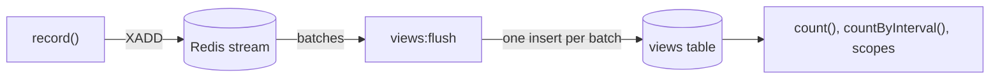

<div align="center">
  <a href="https://github.com/cyrildewit/eloquent-viewable">
    
  </a>
  <h3 align="center">Eloquent Viewable</h3>
  <p align="center">
    A minimalistic analytics package for Laravel with seamless view tracking for Eloquent models
  </p>
  <br/>
  <p align="center">
    <a href="https://packagist.org/packages/cyrildewit/eloquent-viewable"></a>        
      <a href="https://packagist.org/packages/cyrildewit/eloquent-viewable"></a>
      <a href="https://github.com/cyrildewit/eloquent-viewable/actions"></a>
      <a href="https://packagist.org/packages/cyrildewit/eloquent-viewable"></a>
      <a href="https://codecov.io/gh/cyrildewit/eloquent-viewable"></a>
  </p>
</div>
<hr/>
<details>
  <summary>Table of Contents</summary>
  <ol>
    <li><a href="#introduction">Introduction</a>
      <ul>
        <li><a href="#start-simple-scale-when-you-need-to">Start simple, scale when you need to</a></li>
      </ul>
    </li>
    <li><a href="#getting-started">Getting Started</a>
      <ul>
        <li><a href="#version-compatibility">Version Compatibility</a></li>
        <li><a href="#installation">Installation</a></li>
      </ul>
    </li>
    <li><a href="#usage">Usage</a>
      <ul>
        <li><a href="#preparing-your-model">Preparing your model</a></li>
        <li><a href="#recording-views">Recording views</a></li>
        <li><a href="#queueing-view-recording">Queueing view recording</a></li>
        <li><a href="#setting-a-cooldown">Setting a cooldown</a></li>
        <li><a href="#recording-without-a-cookie">Recording without a cookie</a></li>
        <li><a href="#retrieving-view-counts">Retrieving view counts</a></li>
        <li><a href="#ordering-and-filtering-models-by-view-count">Ordering and filtering models by view count</a></li>
        <li><a href="#most-viewed-across-the-app">Most viewed across the app</a></li>
        <li><a href="#get-view-counts-of-models-you-already-have">Get view counts of models you already have</a></li>
        <li><a href="#view-collections">View collections</a></li>
        <li><a href="#who-viewed-what">Who viewed what</a></li>
        <li><a href="#storing-context-with-a-view">Storing context with a view</a></li>
        <li><a href="#remove-views-on-delete">Remove views on delete</a></li>
        <li><a href="#caching-view-counts">Caching view counts</a></li>
      </ul>
    </li>
    <li><a href="#samples">Samples</a></li>
    <li><a href="#testing">Testing</a></li>
    <li><a href="#optimizing">Optimizing</a>
      <ul>
        <li><a href="#database-indexes">Database indexes</a></li>
        <li><a href="#storing-counts-on-your-own-table">Storing counts on your own table</a></li>
        <li><a href="#buffering-views-in-redis">Buffering views in Redis</a></li>
      </ul>
    </li>
    <li><a href="#extending">Extending</a>
      <ul>
        <li><a href="#custom-information-about-visitor">Custom information about visitor</a></li>
        <li><a href="#using-your-own-view-eloquent-model">Using your own View Eloquent model</a></li>
        <li><a href="#customizing-how-views-are-created">Customizing how views are created</a></li>
        <li><a href="#choosing-where-views-are-stored">Choosing where views are stored</a></li>
        <li><a href="#adding-a-recording-guard">Adding a recording guard</a></li>
        <li><a href="#customizing-how-views-are-counted">Customizing how views are counted</a></li>
        <li><a href="#adding-a-bucket-grammar-for-another-database-driver">Adding a bucket grammar for another database driver</a></li>
        <li><a href="#using-a-custom-crawler-detector">Using a custom crawler detector</a></li>
        <li><a href="#adding-macros-to-the-views-class">Adding macros to the Views class</a></li>
      </ul>
    </li>
    <li><a href="#upgrading">Upgrading</a></li>
    <li><a href="#changelog">Changelog</a></li>
    <li><a href="#contributing">Contributing</a></li>
    <li><a href="#credits">Credits</a></li>
  </ol>
</details>

## Introduction

**Eloquent Viewable** is a flexible and minimalistic analytics package for Laravel that allows seamless tracking of
views for Eloquent models. Rather than incrementing a single counter, it stores each view as its own database record,
so you can analyze totals, unique visitors, and custom time periods entirely within your own application. Whether
you're running a blog, an e-commerce store, or a custom Laravel application, this package lets you log and analyze
views without relying on external analytics services.

### Quick Example

Once installed, you can track and retrieve views effortlessly:

```php
// Record a view
views($post)->record();

// Return total view count
views($post)->count();

// Return unique view count of the past 7 days, compared with the 7 days before
views($post)->unique()->period(Period::pastDays(7))->compare();

// Daily counts for a chart
views($post)->period(Period::pastDays(30))->countByInterval(Granularity::Day);
```

### Key Features

- Track **total** and **unique** views for any Eloquent model, from a controller or with one route middleware
- Query views by custom periods, compare with the previous period and group them **per hour, day, week, month or year**
- Order and filter models by views, and rank the **most viewed content** across every model
- Know **who viewed what** by linking views to the signed-in user
- Prevent duplicate views with a configurable **cooldown system**
- Count unique visitors **without a cookie**, with a daily rotating fingerprint
- Ignore views from **crawlers, blocked IPs, prefetches, and visitors who opt out** with Do Not Track or Global Privacy
  Control
- Scale with **caching, queued recording or a Redis buffer**, and test with `Views::fake()`

### Start simple, scale when you need to

Out of the box every view is one insert during the request and every count is one query. That is fine for most
applications and needs nothing beyond the migration. When traffic grows, switch on what you need, one config key at a
time. Counts always read from the `views` table, so none of these changes how you query.

| Option                                                  | What you gain                                                    | What you need                                     |
|---------------------------------------------------------|------------------------------------------------------------------|---------------------------------------------------|
| Default                                                 | Views count immediately, nothing to set up                       | The migration                                     |
| [`remember()`](#caching-view-counts)                    | Repeated counts, series and rankings served from the cache       | Any cache store                                   |
| [Queued recording](#queueing-view-recording)            | The insert moves out of the request                              | A queue worker                                    |
| [Redis buffer](#buffering-views-in-redis)               | One Redis write per request, one insert per thousand views       | Redis 7+ and a scheduled `views:flush`            |
| [Optional indexes](#database-indexes)                   | Faster unique counts and counts over a whole model type          | A migration of your own                           |
| [Counts on your own table](#storing-counts-on-your-own-table) | Fast sorting of large lists by views                       | A column and a scheduled command                  |
| [Cache cooldowns](#setting-a-cooldown)                  | Cooldowns on stateless API routes                                | Any shared cache store                            |
| [Fingerprint identity](#recording-without-a-cookie)     | Unique visitors without setting a cookie                         | A shared cache store, trusted proxies configured  |

## Getting Started

### Version Compatibility

| Package Version                                                            | Laravel    | PHP  |
|----------------------------------------------------------------------------|------------|------|
| [9.x](https://packagist.org/packages/cyrildewit/eloquent-viewable#9.x-dev) | 13.x       | 8.5+ |
| [8.x](https://packagist.org/packages/cyrildewit/eloquent-viewable#8.x-dev) | 13.x       | 8.5+ |
| [7.x](https://packagist.org/packages/cyrildewit/eloquent-viewable#7.x-dev) | 6.x – 13.x | 7.4+ |

Support for Lumen is not maintained.

### Installation

Install the package via Composer, publish the migration and run it:

```bash
composer require cyrildewit/eloquent-viewable:^9
php artisan vendor:publish --provider="CyrildeWit\EloquentViewable\EloquentViewableServiceProvider" --tag="migrations"
php artisan migrate
```

Optionally publish the config file:

```bash
php artisan vendor:publish --provider="CyrildeWit\EloquentViewable\EloquentViewableServiceProvider" --tag="config"
```

#### Models keyed by UUID or ULID

The migration follows your application's morph key type, so if you already call `Schema::morphUsingUuids()` or
`Schema::morphUsingUlids()` it needs no changes. Otherwise edit the published migration before running it:

```php
$table->uuidMorphs('viewable');         // or ulidMorphs('viewable')
$table->nullableUuidMorphs('viewer');   // or nullableUlidMorphs('viewer'), to match your user model
```

All viewable models share one `viewable_id` column, so they need the same key type.

## Usage

### Preparing your model

Implement the `Viewable` interface and use the `InteractsWithViews` trait:

```php
use Illuminate\Database\Eloquent\Model;
use CyrildeWit\EloquentViewable\Concerns\InteractsWithViews;
use CyrildeWit\EloquentViewable\Contracts\Viewable;

class Post extends Model implements Viewable
{
    use InteractsWithViews;
}
```

### Recording views

Record a view in the controller method that shows the model:

```php
public function show(Post $post)
{
    views($post)->record();

    return view('post.show', compact('post'));
}
```

`record()` returns `true` when the view was stored or queued and `false` when a guard refused it. The guards are listed
under `recording.guards` in the config. Out of the box they drop crawlers, the addresses in
`recording.ignored_ip_addresses` and browser prefetches, and enforce cooldowns. Uncomment `IgnoreDoNotTrack` or
`IgnoreGlobalPrivacyControl` to honour those headers, remove a guard to turn its check off, or
[add your own](#adding-a-recording-guard).

> [!NOTE]
> Tools like **Postman** are often detected as crawlers, so keep `IgnoreCrawlers` in mind when testing.

#### Recording from a route

Or leave the controller alone and add the `views` middleware to the route:

```php
Route::get('/posts/{post}', ShowPost::class)->middleware('views');
```

It records the last route parameter bound to a `Viewable` model, and only for a successful response to a `GET`
request, so a 404, a redirect or a form post records nothing. Name a parameter or a model class to pick another, and
pass options the same way:

```php
use CyrildeWit\EloquentViewable\Http\Middleware\RecordViews;

->middleware('views:user')                                    // the {user} parameter
->middleware(RecordViews::using(Post::class))                 // every parameter bound to a Post
->middleware(RecordViews::using(['user', 'post']))            // both
->middleware(RecordViews::using('post', collection: 'amp', cooldown: 30, queue: true))
```

A parameter that does not resolve to a `Viewable` throws `InvalidViewable` on the first request. A failed write is
reported and the page is still sent. For a condition, a `viewedBy()` or a `context()`, call `views()` in the controller.

> [!TIP]
> Inertia and Livewire reload a page with another `GET` to the same route. A `cooldown` keeps those reloads from
> adding views.

#### Finding out why a view was not recorded

`attempt()` records like `record()` but returns a `Recording\Data\RecordResult`:

```php
use CyrildeWit\EloquentViewable\Recording\Guards\EnforceCooldown;

$result = views($post)->attempt();

$result->recorded;   // true when the view was stored or queued
$result->queued;     // true when the write was handed to the queue
$result->skippedBy;  // the guard that refused the view, or null

$result->wasSkippedBy(EnforceCooldown::class);
```

Each refusal also dispatches `Recording\Events\ViewSkipped` with the attempt and the guard, so you can log skipped views
without touching the code that records them.

### Queueing view recording

Move the insert to a queue worker to keep busy pages fast. Queue a single view, or every view from the config:

```php
views($post)->queue()->record();
views($post)->queue(false)->record(); // record synchronously when queueing is on globally
```

```php
'recording' => [
    'queue' => [
        'enabled' => true,
        'connection' => null,   // null uses the default queue connection
        'queue' => null,        // null uses the connection's default queue
    ],
],
```

The guards still run during the request, so bots and views on cooldown are never queued. Leave queueing off when you
use the [Redis buffer](#buffering-views-in-redis), which already moves the write out of the request.

> [!WARNING]
> A queued view dispatches `ViewRecorded` from the worker, where the session, cookies, `request()` and `auth()` are
> unavailable. Read what you need from `$event->record`, which carries the viewer and the
> [context](#storing-context-with-a-view) captured during the request.

### Setting a cooldown

A cooldown ignores repeated views of the same model by the same visitor for a number of minutes, or until a given time:

```php
views($post)->cooldown(30)->record();
views($post)->cooldown(now()->addHours(3))->record();
```

While a cooldown runs, `record()` returns `false` and `attempt()` reports `EnforceCooldown`. Two requests that arrive at
the same moment may both be recorded.

Cooldowns are kept in the session by default, so they do nothing on routes without one, such as stateless API routes.
Set `cooldown.store` to `cache` to keep them in a cache store instead:

```php
'cooldown' => [
    'store' => 'cache',
    'cache' => [
        'store' => 'redis', // null uses the default cache store
    ],
],
```

To add a store, implement `Cooldowns\Contracts\CooldownStore` and register it with
`CooldownManager::extend()` in a service provider.

### Recording without a cookie

By default each guest gets a cookie with a random id, which `unique()` counts and cooldowns are keyed on. Set
`visitor.identity` to `fingerprint` to identify guests without one:

```php
'visitor' => [
    'identity' => 'fingerprint',
    'fingerprint' => [
        'store' => 'redis', // null uses the default cache store
    ],
],
```

The visitor id becomes an HMAC of the truncated IP address (/24 for IPv4, /48 for IPv6) and the user agent, keyed with a
salt that rotates at midnight. Neither the IP address nor the user agent is stored, and once the salt is gone a hash
cannot be traced back. Signed-in users are identified by their account instead, as with the
[`viewer` identity](#counting-one-account-as-one-visitor).

The trade-offs compared to the cookie:

- **`unique()` counts visitors per day.** The same guest on Monday and Tuesday counts twice over a week.
- **Cooldowns end at midnight** at the latest.
- **Visitors sharing a network and browser count as one**, so unique counts come out lower. Totals are unaffected.
- **Configure trusted proxies** behind a load balancer or CDN, or every visitor hashes the same address.
- **Every server needs the same cache store** for the salt. The `array` store does not work.
- **Use the `cache` cooldown store**, because the `session` store still sets the session cookie.

Whether you need consent depends on your jurisdiction and the rest of your application, not only on this package.

### Retrieving view counts

```php
views($post)->count();
views($post)->unique()->count();
views(Post::class)->count();            // every post together, also views(new Post)
```

#### Periods

Narrow a count to a period:

```php
use CyrildeWit\EloquentViewable\Support\Period;

views($post)->period(Period::create('2017-01-01', '2018-01-01'))->count();
```

A period includes its start and excludes its end, so `Period::create('2018-01-01', '2018-02-01')` is January.

```php
Period::create($start, $end);
Period::since($start);
Period::upto($end);                    // up to, but not including

Period::pastDays(7);                   // from midnight 7 days ago, also pastWeeks, pastMonths, pastYears
Period::subHours(6);                   // from now minus 6 hours, also subSeconds, subMinutes, subDays, ...
Period::pastDays(7, 'Australia/Sydney'); // from midnight in that timezone
```

`Period::parse()` reads the short forms a dashboard puts in a URL, and `Period` binds as a route parameter, responding
with a 404 to anything it cannot read:

```php
Period::parse('7d');                       // pastDays(7), likewise 3w, 6m, 1y
Period::parse('12h');                      // subHours(12), likewise 30min and 90s
Period::parse('2026-01-01..2026-02-01');   // create(), and '2026-01-01..' or '..2026-02-01' for open ends

Route::get('/posts/{post}/stats/{period}', fn (Post $post, Period $period) => views($post)->period($period)->count());

route('posts.stats', [$post, Period::pastDays(7)]); // /posts/1/stats/7d
```

`viewed_at` is stored in your application timezone. Keep `app.timezone` at `UTC` unless you have a reason not to.

#### Compare with the previous period

`compare()` counts the period and the one right before it, of the same width:

```php
$trend = views($post)->period(Period::pastDays(7))->compare();

$trend->current;        // 340
$trend->previous;       // 290
$trend->delta;          // 50
$trend->percent;        // 17.2, or null when there were no views before
$trend->previousPeriod; // Period, for a "compared with 20–27 Aug" label
```

The result is `JsonSerializable`, so a controller can return it. A period without both bounds, such as
`Period::since()`, has no width and throws `InvalidPeriod`.

#### Get view counts grouped by interval

`countByInterval()` returns the count per hour, day, week, month or year, with empty buckets filled in with zero:

```php
use CyrildeWit\EloquentViewable\Support\Granularity;

$series = views($post)
    ->period(Period::pastDays(30))
    ->countByInterval(Granularity::Day);

$series->labels();  // ['2026-09-01', '2026-09-02', ...]
$series->values();  // [14, 22, ...]
$series->total();   // the same number as count() over the period
$series->peak();    // the busiest Bucket, with start, end, label and count
```

The series is `JsonSerializable`, so it feeds a chart straight from a controller. Buckets follow the calendar, weeks
start on Monday, and `views($post)->period($bucket->period())->count()` gives the same number as the bucket.

Buckets follow your application timezone. Pass `timezone('Australia/Sydney')` to start each day at Sydney midnight;
daylight saving transitions are handled without timezone tables in the database. A call that would produce more than
`querying.max_intervals` buckets (10,000 by default) throws `InvalidInterval`.

Grouping happens in the database, with a grammar for SQLite, MySQL, MariaDB and Postgres. Other drivers need
[a grammar of their own](#adding-a-bucket-grammar-for-another-database-driver).

#### Get view counts per collection

```php
views($post)->countByCollection();
// ['' => 1200, 'sidebar' => 340, 'feed' => 88], most viewed first, '' for views without a collection
```

#### Combining

Every option combines with every way of counting: `unique()`, `period()`, `collection()`, `viewedBy()`, `timezone()` and
`remember()` work with `count()`, `compare()`, `countByInterval()`, `countByCollection()`, `counts()` and `top()`.

### Ordering and filtering models by view count

```php
Post::orderByViews()->get();                                        // most viewed first
Post::orderByViews('asc')->get();
Post::orderByUniqueViews('desc', Period::pastDays(3))->get();
Post::orderByViews('desc', null, 'custom-collection')->get();

Post::whereViewsCount('>=', 1000)->get();
Post::whereUniqueViewsCount('>=', 50, Period::pastDays(30))->get();
Post::whereViewsCount('>=', 100)->orderByViews()->get();
```

`whereViewsCount()` takes the same period and collection arguments, counts a model without views as zero, and accepts
`=`, `!=`, `<>`, `<`, `<=`, `>` and `>=`. Both scopes run a subquery per row, so narrow the query where you can. To
only check whether a model has any views, `Post::has('views')` is cheaper. For large lists, see
[storing counts on your own table](#storing-counts-on-your-own-table).

### Most viewed across the app

`Views::top()` ranks the most viewed content across every model type:

```php
use CyrildeWit\EloquentViewable\Facades\Views;

$ranking = Views::period(Period::pastDays(7))->top(5);

foreach ($ranking as $entry) {
    $entry->rank;      // 1, 2, 3, ...
    $entry->count;     // the number of views
    $entry->viewable;  // a Post, a Video, ... whichever model it is
}

views(Post::class)->top(10);  // within one model
```

The models are loaded with one query per type and never cached, so a `remember()`ed ranking shows fresh attributes. A
model that can no longer be loaded, for example because it was deleted, is left out, so a ranking can hold fewer
entries than the limit. The ranking serializes to JSON as `rank`, `count` and `viewable`.

### Get view counts of models you already have

For a page of results you already loaded, `forViewables()` counts them all in one query instead of one per model:

```php
$posts = Post::query()->latest()->paginate(20);

$counts = Views::forViewables($posts)->period(Period::pastDays(7))->counts();

$counts[$post->getKey()]; // 0 for a post without views
```

It takes any collection, paginator or array of saved models of one type. With `remember()`, only the models missing
from the cache are counted.

### View collections

Store different kinds of views of the same model in their own collection, and count them the same way:

```php
views($post)->collection('customCollection')->record();
views($post)->collection('customCollection')->count();
```

### Who viewed what

A view can be linked to the signed-in model through the polymorphic `viewer_type` and `viewer_id` columns, so any model
can be a viewer. Guests leave them `null`.

#### Recording the viewer

Recording the viewer is off by default, because it ties a view to an identity. Turn it on in the config; `guard` names
the auth guard, and `null` means the default one:

```php
'recording' => [
    'viewer' => [
        'enabled' => true,
        'guard' => null,
    ],
],
```

To credit a view to a model yourself, for example in a console command, use `viewedBy()`. It works whether or not the
switch is on. A queued view keeps its viewer.

```php
views($post)->viewedBy($user)->record();
```

#### Counting the views of one viewer

```php
views($post)->viewedBy($user)->count();
views(Post::class)->viewedBy($user)->period(Period::pastDays(7))->count(); // every post
```

#### Counting one account as one visitor

By default `unique()` counts browsers, so a user on three devices counts three times. Set `visitor.identity` to `viewer`
to count signed-in users by their account instead. Guests keep the cookie id.

```php
'visitor' => [
    'identity' => 'viewer',
],
```

The id is an HMAC of the model with `app.key`, so rotating the application key splits the unique counts of signed-in
users at that moment. A guest who signs in counts as two visitors.

#### Which models a viewer has seen

```php
Post::whereViewedBy($user)->get();
Post::whereNotViewedBy($user)->get();                       // the unread ones
Post::whereViewedBy($user, Period::pastDays(7))->get();
Post::whereNotViewedBy($user, collection: 'sidebar')->get();

Post::whereNotViewedByVisitor($visitorId)->get();          // for guests, by visitor id
```

#### The viewer side

Add the optional `HasViewHistory` trait to the model that views things:

```php
use CyrildeWit\EloquentViewable\Concerns\HasViewHistory;

class User extends Authenticatable
{
    use HasViewHistory;
}

$user->viewed()->with('viewable')->paginate();   // what they looked at, newest first
$user->hasViewed($post, Period::pastDays(7));    // bool
$user->lastViewedAt($post);                      // Carbon or null
```

Each `View` also has a `viewer` relation and `byViewer()` and `byVisitor()` scopes.

#### Deleting a user

There is no foreign key, so a deleted user's views keep pointing at a model that is gone. To keep the counts but drop
the identity, detach them first:

```php
$user->viewed()->update(['viewer_type' => null, 'viewer_id' => null]);
```

### Storing context with a view

Keep anything else with a view, such as a referrer, a source or a tenant, in the nullable `context` JSON column. The
package writes it and never reads it. A queued view keeps it.

```php
views($post)->context(['source' => request('src')])->record();

$post->views()->where('context->source', 'newsletter')->count();
```

A JSON path cannot use the table's indexes. If one key is queried often, add an indexed generated column for it in a
migration of your own.

### Remove views on delete

A model's views are deleted with it. A soft delete keeps them until `forceDelete()`. To keep the views, override
`shouldRemoveViewsOnDelete()`:

```php
public function shouldRemoveViewsOnDelete(): bool
{
    return false;
}
```

To drop the views of a soft-deleted model anyway, call `views($post)->destroy()`.

### Caching view counts

Add `remember()` to cache a count, a series or a ranking. The lifetime is forever by default:

```php
views($post)->remember()->count();
views($post)->remember(3600)->count();                          // for an hour
views($post)->remember(now()->addWeeks(2))->count();
views($post)->period(Period::pastDays(30))->remember()->countByInterval(Granularity::Day);
Views::period(Period::pastDays(7))->remember()->top(10);
```

Relative periods such as `Period::pastDays(30)` are cached too. Recording a view leaves a remembered count alone;
deleting views forgets it. To forget remembered counts yourself, for example after an import:

```php
views($post)->forgetCache();      // the post, its type and every ranking
views(Post::class)->forgetCache(); // every post
Views::flushCache();               // everything
```

This works on every cache store, including those without tags. For fresher counts, use a shorter lifetime.

## Samples

The [`samples`](samples) directory has real-world scenarios that combine several features, such as a
[trending articles](samples/TrendingArticles) list, a [stats page](samples/ListingStats) for one listing, a
[most viewed](samples/PopularProducts) sort over a large catalog or a news site that
[buffers views in Redis](samples/BreakingNews) through a traffic spike. Each sample is tested with the rest of the
suite.

## Testing

`Views::fake()` swaps storage for an in-memory fake, so a test records views without a `views` table and reads them
back through the same `views()` calls:

```php
use CyrildeWit\EloquentViewable\Facades\Views;
use CyrildeWit\EloquentViewable\Data\ViewRecord;

it('records a view of the post', function (): void {
    $fake = Views::fake();

    $this->get(route('posts.show', $post));

    $fake->assertRecorded($post);
    $fake->assertRecorded($post, 1);
    $fake->assertRecorded($post, fn (ViewRecord $record): bool => $record->collection === 'sidebar');
    $fake->assertNotRecorded($otherPost);
    $fake->assertNothingRecorded();
    $fake->assertForgotten($post);
});
```

The guards still run. Every count reads from the fake, but the scopes, `withViewsCount()`, `orderByViews()`,
`whereViewsCount()` and the `whereViewedBy()` family, need SQL and throw `Querying\Exceptions\UnsupportedBySource`.

For tests and seeders that need real rows, the `View` model ships a factory:

```php
use CyrildeWit\EloquentViewable\Models\View;

View::factory()->for($post, 'viewable')->count(3)->create();
View::factory()->for($post, 'viewable')->fromVisitor('visitor_one')->inCollection('sidebar')->create();
View::factory()->for($post, 'viewable')->viewedAt(now()->subDays(2))->by($user)->create();
```

## Optimizing

Every view is its own row, so the `views` table grows with traffic. The table in
[Start simple, scale when you need to](#start-simple-scale-when-you-need-to) lists what to switch on. Two more things
help at scale: deleting rows you no longer need from a scheduled command, as the package does not prune them, and
partitioning the table.

The repository has a [benchmark suite](benchmarks) that times the expensive paths against millions of seeded views on
every supported database. The optional indexes below were measured with it.

### Database indexes

The migration indexes `(viewable_type, viewable_id)` and `(viewable_type, viewable_id, viewed_at)`, so period counts and
series only read the rows inside the period. If you installed before the second index existed, the
[upgrade guide](UPGRADING.md#4-add-the-new-columns-and-index) has a migration for it.

Two optional indexes, added in a migration of your own:

- `visitor` as a fourth column of that composite index, or `include (visitor)` on Postgres, speeds up `unique()` counts.
- `(viewable_type, viewed_at)` speeds up counts over a whole type within a period, such as
  `views(Post::class)->countByInterval()`.

### Storing counts on your own table

`remember()` caches counts, but `orderByViews()` and `whereViewsCount()` still count in SQL on every query. For large
lists, store the count in a column of your own, such as `unique_views_count`, refresh it from a scheduled command and
sort on that:

```php
Post::query()->each(function (Post $post): void {
    $post->unique_views_count = views($post)->unique()->count();
    $post->save();
});
```

### Buffering views in Redis

The `redis` store replaces the insert during the request with one `XADD` to a Redis stream. A scheduled command moves
the buffered views into the `views` table, a thousand rows per insert statement.


```mermaid
flowchart LR
    record["record()"] -->|"XADD"| stream[("Redis stream")]
    stream -->|"batches"| flusher["views:flush"]
    flusher -->|"one insert per batch"| table[("views table")]
    table --> reads["count(), countByInterval(), scopes"]
```

Setting it up takes three steps:

1. Run Redis 7 or newer, with the `phpredis` extension or Predis 3.3+ (`composer require predis/predis`).
2. Switch the store:

   ```php
   'recording' => [
       'store' => [
           'driver' => 'redis',
           'redis' => [
               'connection' => null, // a connection from database.redis, null is the default one
           ],
       ],
   ],
   ```

3. Schedule the flush:

   ```php
   Schedule::command('views:flush')->everyMinute()->withoutOverlapping();
   ```

`views:flush --batch=500` sets the batch size, and `Recording\Jobs\FlushBufferedViewsJob` does the same from a job.
Running several flushers at once is safe.

What to know:

- **Counts lag until the next flush**, because they read the `views` table.
- **A view may land twice** if a flusher crashes between inserting a batch and acknowledging it.
- **`ViewRecorded` means the stream accepted the view**, not that the row exists yet.
- **Leave `recording.queue.enabled` off**, it gains nothing on top of the buffer.
- **Treat Redis like a queue.** The stream grows until the flusher runs, so monitor `views:flush`. Use
  `maxmemory-policy` `noeviction` or a `volatile-*` policy so Redis never evicts the stream, and enable persistence if a
  restart must not lose up to a minute of views.

## Extending

You can replace these classes with your own, as long as they implement the same interface:

- `CyrildeWit\EloquentViewable\Models\View`
- `CyrildeWit\EloquentViewable\Visitors\Visitor`
- `CyrildeWit\EloquentViewable\Crawlers\Detectors\CrawlerDetectAdapter`
- `CyrildeWit\EloquentViewable\Recording\Actions\RecordView`
- `CyrildeWit\EloquentViewable\Recording\Stores\DatabaseStore`
- `CyrildeWit\EloquentViewable\Recording\Stores\NullStore`
- `CyrildeWit\EloquentViewable\Recording\Guards\IgnoreCrawlers`, `IgnoreDoNotTrack`, `IgnoreGlobalPrivacyControl`,
  `IgnoreIpAddresses`, `IgnorePrefetch` and `EnforceCooldown`
- `CyrildeWit\EloquentViewable\Querying\Sources\DatabaseSource`

### Custom information about visitor

The `Visitor` class reads the current visitor from the request: a unique id from a cookie, the signed-in model, the IP
address, the user agent, and the Do Not Track and Global Privacy Control signals. On a RESTful API without that request
information, provide your own by implementing `CyrildeWit\EloquentViewable\Visitors\Contracts\Visitor` or extending the
default class. Return `null` for a user agent you do not have; it is never treated as a crawler.

Bind it globally in a service provider, or pass it for one call:

```php
$this->app->bind(
    \CyrildeWit\EloquentViewable\Visitors\Contracts\Visitor::class,
    \App\Services\Views\Visitor::class
);

views($post)->useVisitor(new Visitor())->record();
```

### Using your own `View` Eloquent model

Extend the shipped model and name your class in the config:

```php
// config/eloquent-viewable.php
'models' => [
    'view' => [
        'class' => \App\Models\View::class,
    ],
],
```

```php
namespace App\Models;

use CyrildeWit\EloquentViewable\Models\View as BaseView;

class View extends BaseView
{
    // ...
}
```

A class that does not extend the shipped model throws `InvalidConfiguration`. If you rename the table through the
model, set `table_name` to match, because the migration reads the config.

### Customizing how views are created

The `RecordView` action receives every `ViewRecord` that passed the guards, hands it to the store and dispatches
`ViewRecorded`. Bind your own to add attributes or skip the event. To only change where views are written,
[register a store](#choosing-where-views-are-stored) instead.

```php
use CyrildeWit\EloquentViewable\Data\ViewRecord;
use CyrildeWit\EloquentViewable\Recording\Contracts\RecordsViews;

final class RecordView implements RecordsViews
{
    public function handle(ViewRecord $record): void
    {
        // ...
    }
}

$this->app->bind(RecordsViews::class, \App\Actions\Views\RecordView::class);
```

### Choosing where views are stored

`recording.store.driver` names the store for every recorded view:

- `database` writes a row to the `views` table. This is the default.
- `redis` buffers views in a Redis stream, see [Buffering views in Redis](#buffering-views-in-redis).
- `array` keeps views in memory for the process, see [Testing](#testing).
- `null` discards every view.

Counts always read from the `views` table. A store that writes elsewhere is a buffer in front of it and implements
`Recording\Contracts\BufferedViewStore`, so `views:flush` can drain it.

To add a driver, implement `Recording\Contracts\ViewStore` and register it in a service provider:

```php
use CyrildeWit\EloquentViewable\Recording\Contracts\ViewStore;
use CyrildeWit\EloquentViewable\Recording\Stores\StoreManager;

$this->app->make(StoreManager::class)->extend('clickhouse', fn ($app): ViewStore => new ClickHouseStore(
    $app->make(ClickHouseClient::class),
));
```

A store implements `store()` for one record, `storeMany()` for a batch and `forget()` to remove every view of a
viewable. Stores bypass Eloquent, so listen for `Recording\Events\ViewRecorded` and not for `View` model events.

### Adding a recording guard

A guard decides whether a call to `record()` becomes a view. `recording.guards` lists them, and the first that refuses
drops the view:

| Guard                        | Refuses                                         | On by default |
|------------------------------|-------------------------------------------------|---------------|
| `IgnoreCrawlers`             | crawlers, judged by the bound `CrawlerDetector` | yes           |
| `IgnoreIpAddresses`          | `recording.ignored_ip_addresses`                | yes           |
| `IgnorePrefetch`             | pages the browser prefetches or prerenders      | yes           |
| `EnforceCooldown`            | a second view inside the cooldown               | yes           |
| `IgnoreDoNotTrack`           | visitors sending `DNT: 1`                       | no            |
| `IgnoreGlobalPrivacyControl` | visitors sending `Sec-GPC: 1`                   | no            |

To add one, implement `Recording\Contracts\RecordingGuard` and add the class to the list. Guards are resolved from the
container.

```php
use CyrildeWit\EloquentViewable\Recording\Contracts\RecordingGuard;
use CyrildeWit\EloquentViewable\Recording\Data\ViewAttempt;
use Illuminate\Contracts\Auth\Guard;

final readonly class IgnoreAuthors implements RecordingGuard
{
    public function __construct(private Guard $auth) {}

    public function allows(ViewAttempt $attempt): bool
    {
        return $attempt->viewable->author_id !== $this->auth->id();
    }
}
```

A guard that keeps state about the views it lets through, as the cooldown does, also implements
`Recording\Contracts\RemembersRecordedViews`, whose `remember()` runs once the view is stored or queued.

### Customizing how views are counted

Every number comes from one `Querying\Contracts\ViewSource`, named by `querying.source.driver`. The shipped `database`
source reads the `views` table. To read from somewhere else, such as a rollup table, implement the contract and register
it:

```php
use CyrildeWit\EloquentViewable\Querying\Contracts\ViewSource;
use CyrildeWit\EloquentViewable\Querying\Sources\SourceManager;

$this->app->make(SourceManager::class)->extend('aggregate', fn ($app): ViewSource => new AggregateSource(
    $app->make(ViewAggregate::class),
));
```

The contract has one method per way of counting: `count()`, `countByInterval()`, `countByCollection()`, `countMany()`
and `top()`. Each method's docblock describes what it returns; the package fills in missing buckets and zeros and sorts
the results.

The scopes add SQL to a query over the viewable's table, so they need a source in the same database that also
implements `Querying\Contracts\SubquerySource`: `countSubquery()` for the counts and `viewsSubquery()` for the
`whereViewedBy()` checks. Any other source throws `Querying\Exceptions\UnsupportedBySource` from a scope. The `database`
source implements both, and a rollup can hand `viewsSubquery()` on to it so the existence checks keep reading the
`views` table.

`remember()` keeps the entries of two sources apart by the driver name. A source whose counts depend on settings of its
own, such as the name of the rollup table, implements `Querying\Contracts\IdentifiesSource` and returns them from
`cacheIdentity()`, so changing them starts fresh entries.

### Adding a bucket grammar for another database driver

`countByInterval()` groups in SQL, which differs per database. For a driver other than SQLite, MySQL, MariaDB or
Postgres, implement `BucketGrammar` and register it. The `Querying\Grammars\Concerns\ConvertsByOffset` trait handles
timezones, so a new grammar only implements `truncate()` and `shift()`.

```php
use CyrildeWit\EloquentViewable\Querying\Grammars\GrammarRegistry;

$this->app->afterResolving(GrammarRegistry::class, function (GrammarRegistry $grammars): void {
    $grammars->register('sqlsrv', \App\Grammars\SqlServerBucketGrammar::class);
});
```

### Using a custom crawler detector

The `IgnoreCrawlers` guard asks the bound `CrawlerDetector` whether a user agent belongs to a crawler. The shipped
detector wraps [CrawlerDetect](https://github.com/JayBizzle/Crawler-Detect).

```php
use CyrildeWit\EloquentViewable\Crawlers\Contracts\CrawlerDetector;

final class ListedCrawlerDetector implements CrawlerDetector
{
    public function isCrawler(?string $userAgent): bool
    {
        return $userAgent !== null && preg_match('/bot|crawler|spider/i', $userAgent) === 1;
    }
}

$this->app->singleton(CrawlerDetector::class, ListedCrawlerDetector::class);
```

### Adding macros to the `Views` class

```php
use CyrildeWit\EloquentViewable\Views;

Views::macro('countByDay', function () {
    return $this->countByInterval(Granularity::Day);
});

views($post)->period(Period::pastDays(30))->countByDay();
```

## Upgrading

Please see [UPGRADING](UPGRADING.md) for detailed upgrade guide.

## Changelog

Please see [CHANGELOG](CHANGELOG.md) for more information on what has changed recently.

## Contributing

Please see [CONTRIBUTING](CONTRIBUTING.md) for details.

## Credits

- **Cyril de Wit** - _Author_ - [cyrildewit](https://github.com/cyrildewit)

See also the list of [contributors](https://github.com/cyrildewit/eloquent-viewable/graphs/contributors) who
participated in this project.

## License

This project is licensed under the MIT License - see the [LICENSE](LICENSE) file for details.
